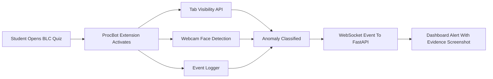
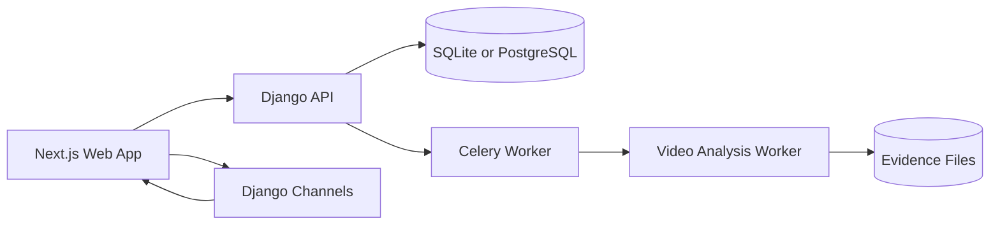

# Sightline

Sightline is an MVP for exam-integrity review.

The current MVP is intentionally small: a teacher uploads an exam video, Sightline analyzes it, and an invigilator reviews evidence-backed alerts. There is no CCTV or live camera requirement for MVP.

## MVP Scope

### In scope now

- video upload for an exam session
- asynchronous video analysis
- suspicious-event alerts with timestamps, confidence, and evidence references
- invigilator review actions: confirm, dismiss, or follow up
- simple admin setup for users, courses, halls, and exams
- four roles: `admin`, `teacher`, `student`, `invigilator`

### Out of scope for MVP

- live CCTV or RTSP camera monitoring
- automated cheating verdicts
- disciplinary automation
- broad academic analytics
- student reminder workflows
- full LMS/SIS integrations

## Later Feature: ProcBot

ProcBot is a future browser-monitoring pipeline for online quizzes. It is not part of the first MVP.



Detection cadence:

| Detection | Method | Cost | Cadence |
| --- | --- | --- | --- |
| TabSwitch | Browser API | Extremely low | Realtime |
| FaceGone | MediaPipe Face Detector | Low | Every 5 sec |
| MultiPerson | MediaPipe Face Detector | Low | Every 5 sec |
| Phone | ONNX/WebGPU tiny model | Medium | Every 15-20 sec |

## Architecture



For local development, SQLite is enough. PostgreSQL, Redis, and object storage remain deployment options.

## Repository Layout

```text
.
├── apps/
│   ├── api-django/        # Django API, domain models, seed data
│   ├── web/               # Next.js web workspace
│   └── worker-inference/  # Video-analysis worker scaffold
├── docs/
│   └── product/           # Simplified MVP docs
├── infra/                 # Local infrastructure
├── packages/              # Shared packages, if needed later
└── scripts/               # Repo maintenance scripts
```

## Running Locally

Prerequisites:

- Python 3.12+
- Node.js 22+

Install dependencies:

```bash
npm install
npm run api:install
```

Create the local database and seed demo data:

```bash
npm run api:migrate
npm run api:seed
```

Start the API and web app:

```bash
npm run dev
```

Open `http://localhost:3000`.

Demo users all use password `sightline`:

- `admin`
- `teacher`
- `invigilator`
- `student`

## Current Implementation Notes

The codebase still contains some prototype tables and endpoints from the earlier larger platform. Treat the docs in `docs/product` as the MVP source of truth: build the upload-analysis-review workflow first, then add ProcBot or live monitoring only after the MVP is stable.
