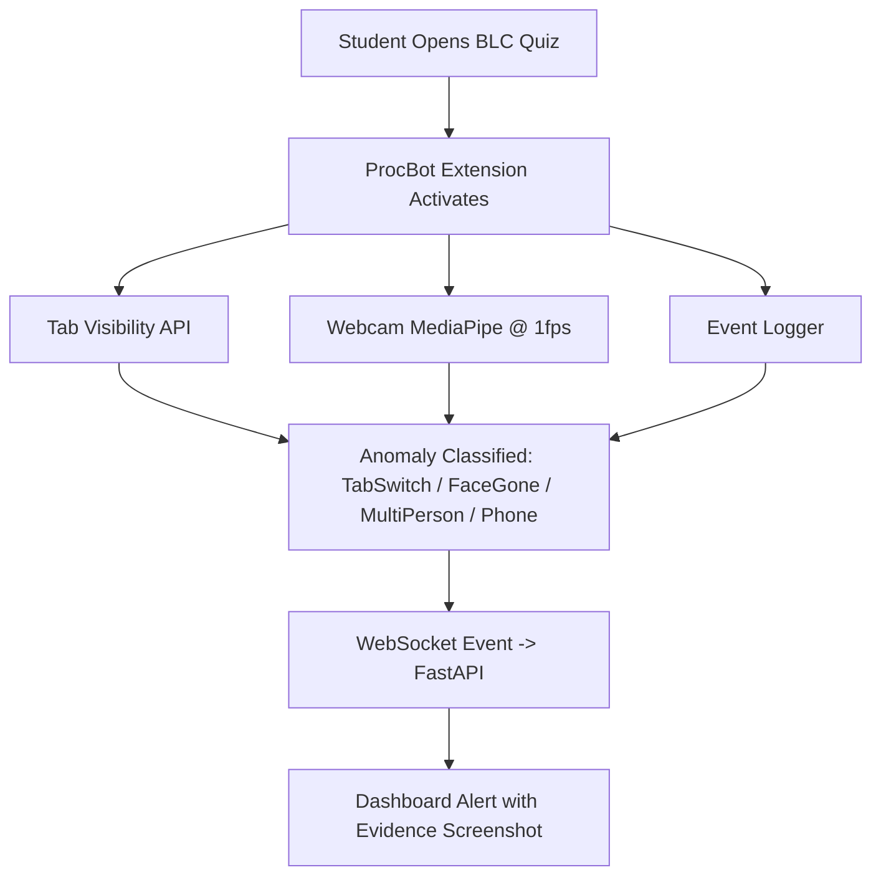
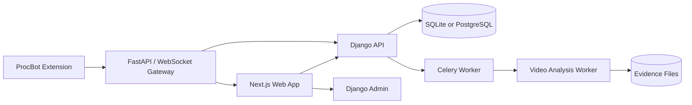

# Sightline

Sightline is an MVP for exam-integrity review and academic risk support.

The first build is intentionally small: admin setup, teacher course/exam workflows, student enrollment/exam submission, invigilator uploaded-video review, and teacher at-risk student identification.

## MVP Roles

- Admin manages everything through Django admin and admin APIs.
- Teacher creates courses, creates exams, uploads course material if needed, and identifies academically at-risk students before the semester ends.
- Invigilator uploads exam videos and monitors/reviews and alerts exam evidence.
- Student enrolls in courses and gives/submits exams.

## MVP Scope

### In scope now

- password login
- four roles: `admin`, `teacher`, `student`, `invigilator`
- Django admin and admin APIs for platform management
- teacher course and exam creation
- optional course-material upload
- student course enrollment
- student exam attempt/submission
- uploaded exam-video analysis
- suspicious-event alerts with timestamps, confidence, and evidence references
- invigilator review actions: confirm, dismiss, or follow up
- teacher at-risk student view before semester end

### Out of scope for first build

- live CCTV or RTSP camera monitoring
- automated cheating verdicts
- disciplinary automation
- full LMS/SIS integrations
- full custom admin frontend
- mobile app

## Additional Requirement: ProcBot

ProcBot is the browser-monitoring pipeline for BLC quizzes.



| Detection | Method | Cost | Cadence |
| --- | --- | --- | --- |
| TabSwitch | Browser API | Extremely low | Realtime |
| FaceGone | MediaPipe Face Detector | Low | Every 5 sec |
| MultiPerson | MediaPipe Face Detector | Low | Every 5 sec |
| Phone | ONNX/WebGPU tiny model | Medium | Every 15-20 sec |

Cadence:

- Realtime: tab switch only.
- Every 5 sec: face detection and multi-person detection.
- Every 15-20 sec: phone detection.

## Architecture



For local development, SQLite is enough. PostgreSQL, Redis, object storage, and a FastAPI/WebSocket gateway remain deployment options.

## Repository Layout

```text
.
├── apps/
│   ├── api-django/        # Django API, domain models, seed data
│   ├── web/               # Next.js web workspace
│   └── worker-inference/  # Video-analysis worker scaffold
├── docs/
│   └── product/           # Simplified MVP docs
├── infra/                 # Local infrastructure
├── packages/              # Shared packages, if needed later
└── scripts/               # Repo maintenance scripts
```

## Running Locally

Prerequisites:

- Python 3.12+
- Node.js 22+

Install dependencies:

```bash
npm install
npm run api:install
```

Create the local database and seed demo data:

```bash
npm run api:migrate
npm run api:seed
```

Start the API and web app:

```bash
npm run dev
```

Open `http://localhost:3000`.

Demo users all use password `sightline`:

- `admin`
- `teacher`
- `invigilator`
- `student`

## Current Implementation Notes

The codebase still contains some prototype tables and endpoints from an earlier larger platform. Treat the docs in `docs/product` as the source of truth for the current MVP.

