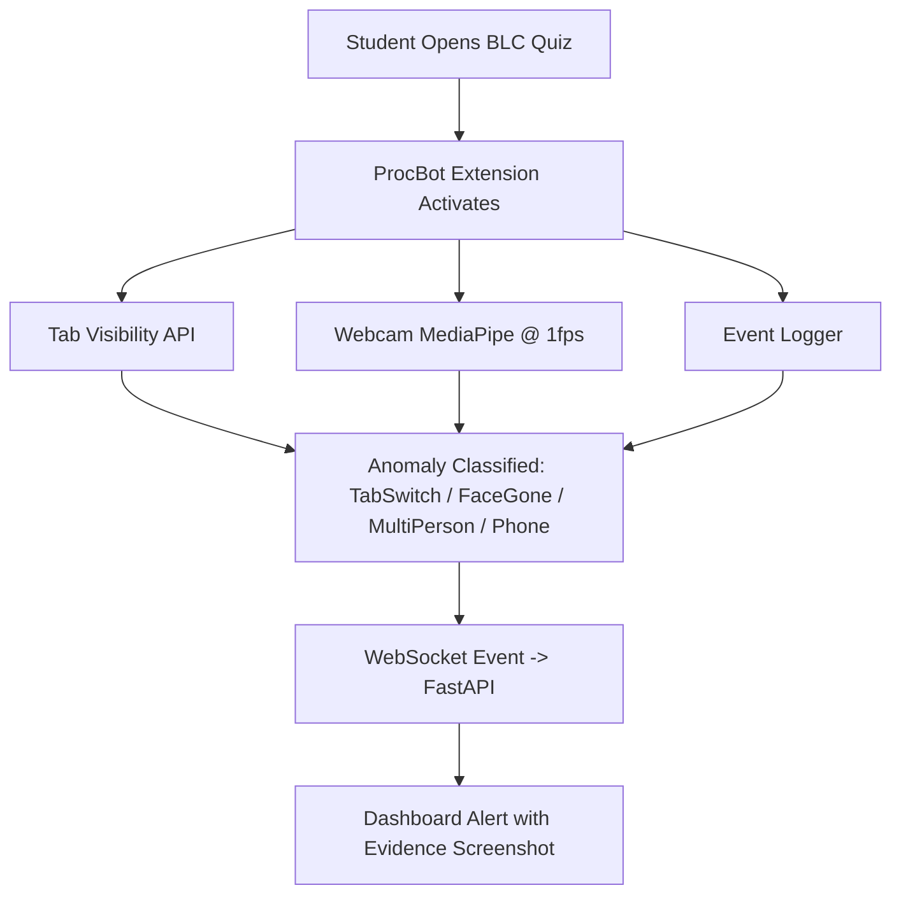
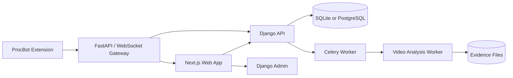

# Sightline

Sightline is an MVP for exam-integrity review and academic risk support.

The first build is intentionally small: admin setup, teacher course/exam workflows, student enrollment/exam submission, invigilator uploaded-video review, and teacher at-risk student identification.

## MVP Roles

- Admin manages everything through Django admin and admin APIs.
- Teacher creates courses, creates exams, uploads course material if needed, and identifies academically at-risk students before the semester ends.
- Invigilator uploads exam videos and monitors/reviews and alerts exam evidence.
- Student enrolls in courses and gives/submits exams.

## MVP Scope

### In scope now

- password login
- four roles: `admin`, `teacher`, `student`, `invigilator`
- Django admin and admin APIs for platform management
- teacher course and exam creation
- optional course-material upload
- student course enrollment
- student exam attempt/submission
- uploaded exam-video analysis
- suspicious-event alerts with timestamps, confidence, and evidence references
- invigilator review actions: confirm, dismiss, or follow up
- teacher at-risk student view before semester end

### Out of scope for first build

- live CCTV or RTSP camera monitoring
- automated cheating verdicts
- disciplinary automation
- full LMS/SIS integrations
- full custom admin frontend
- mobile app

## Additional Requirement: ProcBot

ProcBot is the browser-monitoring pipeline for BLC quizzes.



| Detection | Method | Cost | Cadence |
| --- | --- | --- | --- |
| TabSwitch | Browser API | Extremely low | Realtime |
| FaceGone | MediaPipe Face Detector | Low | Every 5 sec |
| MultiPerson | MediaPipe Face Detector | Low | Every 5 sec |
| Phone | ONNX/WebGPU tiny model | Medium | Every 15-20 sec |

Cadence:

- Realtime: tab switch only.
- Every 5 sec: face detection and multi-person detection.
- Every 15-20 sec: phone detection.

## Architecture



For local development, SQLite is enough. PostgreSQL, Redis, object storage, and a FastAPI/WebSocket gateway remain deployment options.

## Repository Layout

```text
.
├── apps/
│   ├── api-django/        # Django API, domain models, seed data
│   ├── web/               # Next.js web workspace
│   └── worker-inference/  # Video-analysis worker scaffold
├── docs/
│   └── product/           # Simplified MVP docs
├── infra/                 # Local infrastructure
├── packages/              # Shared packages, if needed later
└── scripts/               # Repo maintenance scripts
```

## Running Locally

Prerequisites:

- Python 3.12+
- Node.js 22+

Install dependencies:

```bash
pnpm install
pnpm run api:install
```

Create the local database and seed demo data:

```bash
pnpm run api:migrate
pnpm run api:seed
```

Start the API and web app:

```bash
pnpm run dev
```

Open `http://localhost:3000`.

## Running With Docker

Build and start the web app, Django API, PostgreSQL, and Redis:

```bash
pnpm run docker:up
```

Then open:

- Web: `http://localhost:3000`
- API: `http://localhost:8000`
- Django admin: `http://localhost:8000/admin/`

Seed demo users after the API container is running:

```bash
pnpm run docker:seed
```

Stop the stack:

```bash
pnpm run docker:down
```

Demo users all use password `sightline`:

- `admin`
- `teacher`
- `invigilator`
- `student`

## Production CI/CD

The production flow mirrors the reference deployment pattern:

- `.github/workflows/ci.yml` runs Django checks/tests, web lint/build, and Docker image builds.
- `.github/workflows/deploy-production.yml` reuses CI, builds and pushes API/web images to GHCR, then deploys them over SSH with Docker Compose.
- `compose.prod.yml` is the production compose shape for server use or local validation.
- `.env.production.example` lists the GitHub Actions secrets needed by the deploy workflow.

Required server dependencies:

- Docker
- Docker Compose v2, or legacy `docker-compose`

Configure the secrets from `.env.production.example` in GitHub, then push to `main` or run `Deploy Production` manually from GitHub Actions. The deploy job creates `/opt/sightline`, writes `.env`, `docker-compose.yml`, and nginx config there, pulls the latest GHCR images, starts the stack, waits for nginx health, and prunes old Docker resources.

To validate the production compose file locally, provide the required image/database variables and run:

```bash
pnpm run docker:prod:config
```

## Current Implementation Notes

The codebase still contains some prototype tables and endpoints from an earlier larger platform. Treat the docs in `docs/product` as the source of truth for the current MVP.
