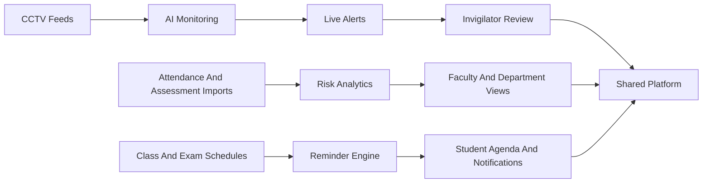
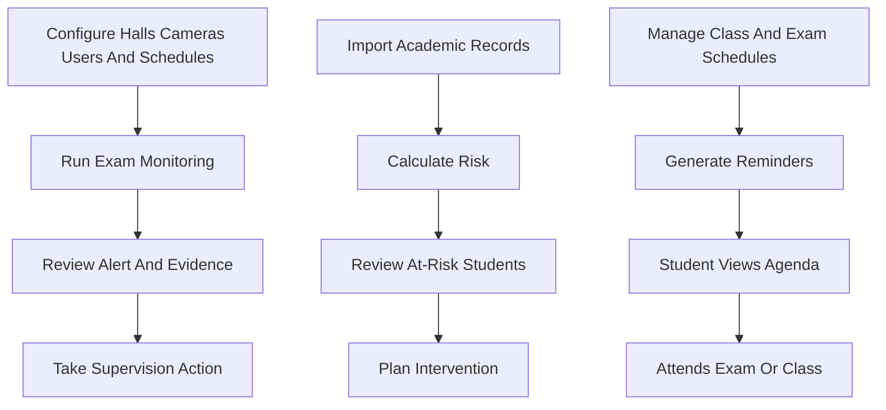
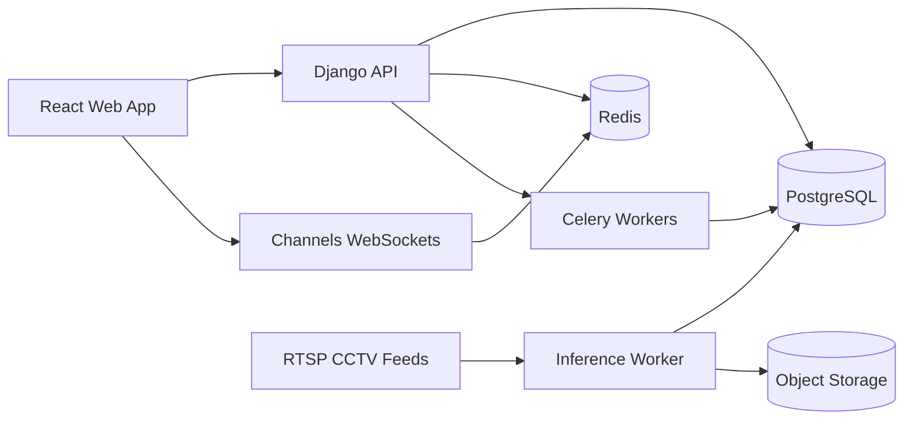

# Sightline

Sightline is a proposed `academic integrity and academic operations platform` centered on one primary outcome:

- help exam supervisors detect and review suspicious behavior in live exam halls

It also includes two supporting modules in the same platform:

- faculty-facing at-risk student analytics
- student-facing schedules and reminders

This repository currently contains the product documentation package that defines the platform in a requirements-first way.

## What The Product Is

Sightline is designed as an `AI-assisted review system`, not an autonomous judge.

For exam supervision, the system watches CCTV feeds and flags observable suspicious behaviors such as:

- repeated looking away from one's own work
- looking toward neighboring desks
- unauthorized device presence such as mobile phones

Those alerts are then reviewed by human invigilators with evidence snapshots or clips.

For faculty and department leadership, the platform processes attendance and assessment data to highlight students who may be academically at risk.

For students, the platform provides one place to view class and exam schedules and receive reminders.

## Product Scope

### Primary capability

- live AI-assisted exam monitoring from CCTV feeds

### Included platform modules

- alert review and evidence workflow for invigilators
- faculty and department risk analytics from imported academic data
- unified class and exam schedules for students
- in-app and email reminders
- admin and operator controls for halls, cameras, users, imports, and schedules

### Explicit non-goals

- automated cheating verdicts
- automated disciplinary actions
- black-box academic judgment with no explanation
- phase-1 SMS or push notifications

## How The Platform Fits Together

## Core User Journeys

## Proposed Architecture

The docs package assumes this stack as the fastest path to a production-ready first implementation:

- `Python + Django` for the control plane, canonical product state, APIs, auth, and auditability
- `React + Vite` for all user-facing web surfaces
- `Django Channels` for live alerts and notification updates
- `Celery + Redis` for background jobs such as imports, reminders, and post-processing
- a separate `Python inference worker` for computer-vision processing
- `PostgreSQL` as the canonical data store
- object storage for evidence snapshots and clips

## Product Principles

- `Human review stays central`: the system produces reviewable suspicion, not verdicts
- `Trust must be visible`: evidence, confidence, and degraded states should be inspectable
- `One platform beats scattered tools`: monitoring, analytics, and reminders should share users, schedules, and audit history
- `Heavy processing stays off the request path`: live inference and background work must not block normal product interactions
- `Requirements drive design`: user stories lead to EARS requirements, which shape workflows, architecture, and delivery slices

## Documentation Map

The main documentation set lives in [docs/product](./docs/product).

Read it in this order:

1. [Product requirements](./docs/product/01-product-requirements.md)
2. [Domain workflows and data](./docs/product/02-domain-workflows-and-data.md)
3. [System architecture](./docs/product/03-system-architecture.md)
4. [Delivery, validation, and roadmap](./docs/product/04-delivery-validation-and-roadmap.md)

The package was intentionally written so that:

- user stories stay non-technical and outcome-driven
- requirements are verifiable through EARS-style criteria
- domain entities and workflows remain consistent across modules
- the architecture follows directly from the documented product behavior
- engineering can break the work into implementation tasks without inventing hidden rules

## Current Repository Status

This repository is currently documentation-first.

What exists today:

- consolidated root overview
- full product doc package under `docs/product`

What is expected next:

- scaffold the Django backend and React frontend
- define the shared data model from the product docs
- build the exam monitoring slice first
- add analytics and reminders on the same platform foundation

## Why This Repo Exists

The purpose of this repo is to make the implementation start cleanly:

- the product intent is explicit
- the core workflows are already mapped
- the requirements are traceable
- the architecture direction is already aligned with the chosen stack

That should reduce ambiguity before code starts and make it easier to assign backend, frontend, AI, and ops work without each stream inventing its own interpretation of the product.
