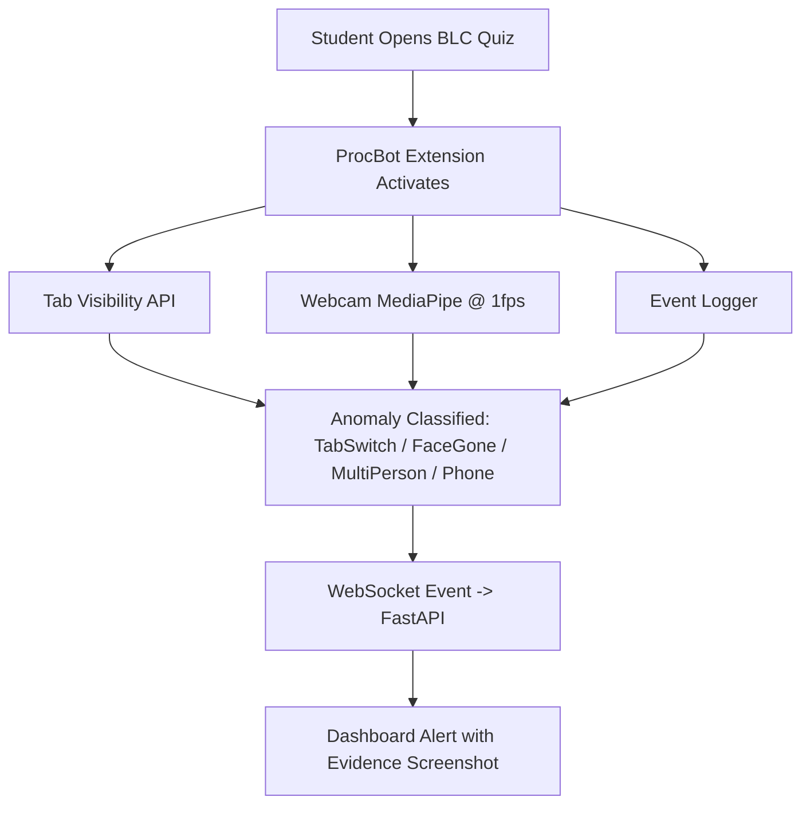

# Sightline MVP Agent Skill

Use this file as the shared operating guide for AI agents working in this repo.

## Project Intent

Sightline is an MVP for academic exam workflows and risk support. Keep the first release small and shippable.

Build these workflows first:

- Admin manages everything through Django admin and admin APIs.
- Teacher creates courses, creates exams, uploads course material if needed, and identifies academically at-risk students before the semester ends.
- Invigilator uploads exam videos and monitors/reviews and alerts exam evidence.
- Student enrolls in courses and gives/submits exams.

ProcBot is an additional browser-monitoring requirement for BLC quizzes:



Detection cadence:

- Realtime: tab switch only.
- Every 1 sec: face detection and multi-person detection.
- Every 1 sec: phone detection.

Keep these out of the first build unless the user explicitly asks:

- live CCTV or RTSP camera monitoring
- full proctoring operations center
- automated cheating verdicts
- disciplinary automation
- full LMS/SIS integration
- mobile app

## Repository Map

- `apps/api-django/` - Django API, domain models, serializers, class-based views, seed data.
- `apps/web/` - Next.js frontend. Current frontend should stay minimal: login plus dashboard/admin surfaces.
- `apps/worker-inference/` - video-analysis worker scaffold.
- `docs/product/` - MVP source of truth.
- `infra/` - local infrastructure.

## Backend Rules

Prefer Django REST Framework serializers and class-based views for new API work.

Keep the model count low. Extend existing models where reasonable instead of adding many small tables.

Core role model:

- `UserProfile.role` supports `admin`, `teacher`, `invigilator`, `student`.
- Admin users should be `is_staff=True` and `is_superuser=True`.
- Non-admin demo users should not be staff/superusers.

Access expectations:

- Admin can do all.
- Teacher can manage own courses, create exams, and run/review student risk.
- Invigilator can upload exam videos and monitor/review alerts and evidence.
- Student can enroll in courses and submit exam attempts.

## Frontend Rules

The first screen should be login. Do not rebuild a marketing landing page unless asked.

Keep frontend scope lean:

- login
- role-aware dashboard
- admin/user management surfaces already present
- simple forms for MVP workflows when asked

Avoid broad landing pages, decorative product sections, or large custom admin screens during MVP cleanup.

## Seed Data

The seed command should create:

- 1 admin
- 3 invigilators
- 5 teachers
- 20 students

Default demo password: `sightline`.

Run seed with:

```bash
pnpm run api:seed
```

or:

```bash
python apps/api-django/manage.py seed_sightline
```

## Validation Checklist

Before handing work back, run the smallest useful checks:

- `python apps/api-django/manage.py check`
- `python apps/api-django/manage.py test sightline`
- `pnpm run web:lint`
- `pnpm run web:build`

If a command cannot run, report the exact reason and what remains unverified.
