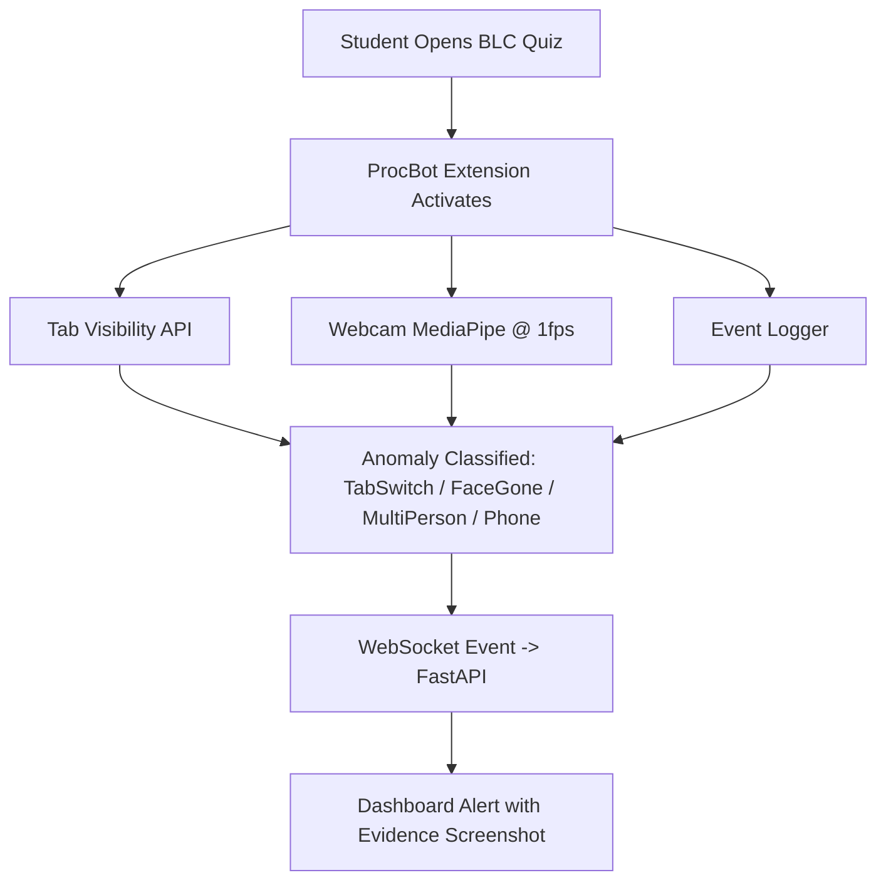

# Sightline MVP - Product Requirements

## 1) Purpose

Sightline is an MVP for academic exam workflows. The first usable product should stay small:

- manage users and academic setup
- let teachers create courses and exams
- let students enroll and submit exams
- let invigilators upload exam videos and review alert evidence
- let teachers identify academically at-risk students before the semester ends
- prepare a later ProcBot browser-monitoring workflow for BLC quizzes

The product must support human review. It must not make autonomous cheating or disciplinary decisions.

## 2) MVP Roles

| Role | MVP Responsibility |
| --- | --- |
| `Admin` | Admin manages everything through Django admin and admin APIs. |
| `Teacher` | Teacher creates courses, creates exams, uploads course material if needed, and identifies academically at-risk students before the semester ends. |
| `Invigilator` | Invigilator uploads exam videos and monitors/reviews and alerts exam evidence. |
| `Student` | Student enrolls in courses and gives/submits exams. |

## 3) MVP Scope

### In scope now

- password login
- four roles: `admin`, `teacher`, `invigilator`, `student`
- Django admin for full administrative control
- admin APIs for user and setup management
- teacher course creation
- teacher exam creation
- optional teacher course-material upload
- student course enrollment
- student exam attempt/submission
- invigilator exam-video upload
- video-analysis result storage
- alert and evidence review
- teacher view for academically at-risk students

### Keep simple for MVP

- Prefer one Django app and a low model count.
- Prefer class-based API views and serializers.
- Prefer Django admin for deep management instead of building every frontend screen now.
- Frontend can be login plus role dashboards/admin surfaces.
- Use uploaded exam video for analysis first.

### Out of scope for the first build

- live CCTV or RTSP camera monitoring
- full proctoring operations center
- automated cheating verdicts
- disciplinary automation
- complete LMS/SIS integration
- mobile app
- SMS/push notification system

## 4) ProcBot Browser Monitoring Requirement

ProcBot is an additional browser-monitoring requirement for BLC quizzes. It can be implemented after the uploaded-video MVP is stable.

### ProcBot detection plan

| Detection | Method | Cost | Cadence |
| --- | --- | --- | --- |
| TabSwitch | Browser API | Extremely low | Realtime |
| FaceGone | MediaPipe BlazeFace Short-Range FP16 | Low | Every 1 sec |
| MultiPerson | MediaPipe BlazeFace Short-Range FP16 | Low | Every 1 sec |
| Phone | MediaPipe EfficientDet-Lite0 INT8 | Low | Every 1 sec |

### ProcBot cadence rules

- Realtime: tab switch only.
- Every 1 sec: face detection and multi-person detection.
- Every 1 sec: phone detection.

## 5) User Stories And Acceptance Criteria

### US-01: Admin Manages The Platform

**User Story:**  
As an `admin`, I want to manage users, roles, courses, exams, and platform records through Django admin and admin APIs, so routine setup does not require engineering work.

| ID | Criteria |
| --- | --- |
| US-01.1 | **WHEN** an admin opens Django admin, **THE SYSTEM SHALL** allow management of users, roles, courses, exams, enrollments, videos, attempts, and alerts. |
| US-01.2 | **WHEN** admin APIs are called by an admin, **THE SYSTEM SHALL** allow full platform management actions. |
| US-01.3 | **IF** a non-admin calls admin APIs, **THEN THE SYSTEM SHALL** reject the request. |

### US-02: Teacher Creates Courses And Exams

**User Story:**  
As a `teacher`, I want to create courses and exams, so students can enroll and submit work under the right academic context.

| ID | Criteria |
| --- | --- |
| US-02.1 | **WHEN** a teacher creates a course, **THE SYSTEM SHALL** associate the course with that teacher. |
| US-02.2 | **WHEN** a teacher creates an exam, **THE SYSTEM SHALL** associate the exam with one of the teacher's courses. |
| US-02.3 | **IF** a teacher tries to manage another teacher's course, **THEN THE SYSTEM SHALL** block the action unless the user is admin. |

### US-03: Teacher Identifies At-Risk Students

**User Story:**  
As a `teacher`, I want to identify academically at-risk students before the semester ends, so I can intervene early.

| ID | Criteria |
| --- | --- |
| US-03.1 | **WHEN** a teacher runs or opens risk analysis for a course, **THE SYSTEM SHALL** show student-level risk outputs for that course. |
| US-03.2 | **WHEN** risk outputs are shown, **THE SYSTEM SHALL** include interpretable contributing factors where available. |
| US-03.3 | **IF** risk data is missing or incomplete, **THEN THE SYSTEM SHALL** show a clear empty or incomplete-data state. |

### US-04: Invigilator Uploads And Reviews Exam Video Evidence

**User Story:**  
As an `invigilator`, I want to upload exam videos and monitor/review alerts and exam evidence, so suspicious events can be reviewed responsibly.

| ID | Criteria |
| --- | --- |
| US-04.1 | **WHEN** an invigilator uploads an exam video, **THE SYSTEM SHALL** attach it to an exam session and record the upload status. |
| US-04.2 | **WHEN** analysis creates alerts, **THE SYSTEM SHALL** show alert type, timestamp, confidence, and evidence reference. |
| US-04.3 | **WHEN** an invigilator reviews an alert, **THE SYSTEM SHALL** allow confirm, dismiss, or follow-up without deleting the alert record. |

### US-05: Student Enrolls And Submits Exams

**User Story:**  
As a `student`, I want to enroll in courses and give/submit exams, so my academic work is recorded in the platform.

| ID | Criteria |
| --- | --- |
| US-05.1 | **WHEN** a student enrolls in a course, **THE SYSTEM SHALL** create one active enrollment for that student and course. |
| US-05.2 | **WHEN** a student starts or submits an exam, **THE SYSTEM SHALL** create or update the student's exam attempt. |
| US-05.3 | **IF** a student tries to access another student's attempt, **THEN THE SYSTEM SHALL** block the action. |

### US-06: ProcBot Captures Browser Quiz Anomalies

**User Story:**  
As an `invigilator`, I want ProcBot browser events from BLC quizzes to create dashboard alerts with evidence screenshots, so online quiz anomalies can be reviewed.

| ID | Criteria |
| --- | --- |
| US-06.1 | **WHEN** a student opens a BLC quiz, **THE SYSTEM SHALL** allow the ProcBot extension to activate event logging. |
| US-06.2 | **WHEN** the tab visibility state changes during the quiz, **THE SYSTEM SHALL** classify TabSwitch in realtime. |
| US-06.3 | **WHEN** face detection runs every 1 second, **THE SYSTEM SHALL** classify FaceGone or MultiPerson when thresholds are met. |
| US-06.4 | **WHEN** phone detection runs every 1 second, **THE SYSTEM SHALL** classify Phone when thresholds are met. |
| US-06.5 | **WHEN** an anomaly is classified, **THE SYSTEM SHALL** send a WebSocket event to FastAPI and show a dashboard alert with an evidence screenshot. |

## 6) Functional Requirements

| ID | Requirement | Supports |
| --- | --- | --- |
| FR-001 | Support password login and role-aware current-user responses | US-01, US-02, US-04, US-05 |
| FR-002 | Provide Django admin and admin APIs for full platform management | US-01 |
| FR-003 | Allow teachers to create and manage their own courses | US-02 |
| FR-004 | Allow teachers to create exams for their courses | US-02 |
| FR-005 | Allow teachers to identify academically at-risk students for a course | US-03 |
| FR-006 | Allow invigilators to upload exam videos for exam sessions | US-04 |
| FR-007 | Store alert evidence and review state for human review | US-04 |
| FR-008 | Allow students to enroll in courses | US-05 |
| FR-009 | Allow students to create or submit exam attempts | US-05 |
| FR-010 | Support ProcBot TabSwitch, FaceGone, MultiPerson, and Phone anomaly events | US-06 |
| FR-011 | Deliver ProcBot anomaly events to dashboard alerts through WebSocket/FastAPI integration | US-06 |

## 7) Non-Functional Requirements

| ID | Requirement | Target |
| --- | --- | --- |
| NFR-001 | Simplicity | Keep MVP implementation small and maintainable. |
| NFR-002 | Role safety | Users can only access actions allowed by their role. |
| NFR-003 | Auditability | Alerts, evidence, uploads, and review decisions remain inspectable. |
| NFR-004 | Explainability | Risk and alert outputs show enough context for human review. |
| NFR-005 | Low latency for ProcBot tab switch | TabSwitch events are realtime. |
| NFR-006 | Cost-aware browser monitoring | Lightweight in-browser detectors run at the required cadence without server-side inference. |

## 8) Release Readiness Checklist

- [ ] Admin can manage users and domain data through Django admin.
- [ ] Admin APIs reject non-admin users.
- [ ] Seed data creates 1 admin, 3 invigilators, 5 teachers, and 20 students.
- [ ] Teacher can create courses.
- [ ] Teacher can create exams.
- [ ] Teacher can view or run at-risk student analysis.
- [ ] Invigilator can upload exam videos.
- [ ] Invigilator can review alerts and evidence.
- [ ] Student can enroll in a course.
- [ ] Student can submit an exam attempt.
- [ ] ProcBot requirement is designed with realtime tab switch, 1-second face checks, and 1-second phone checks.

