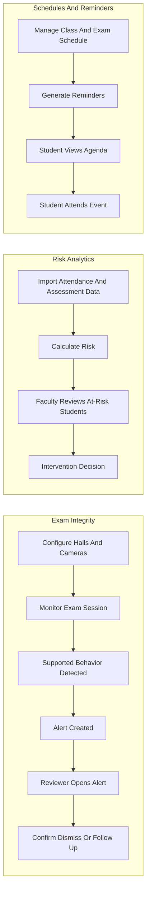
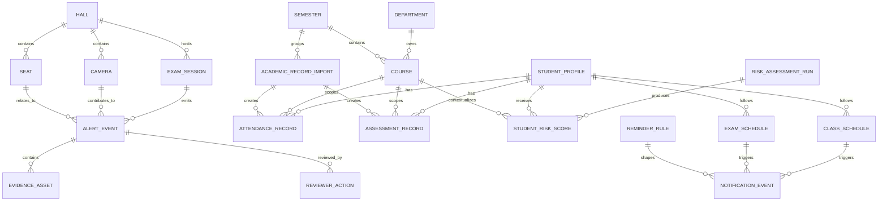
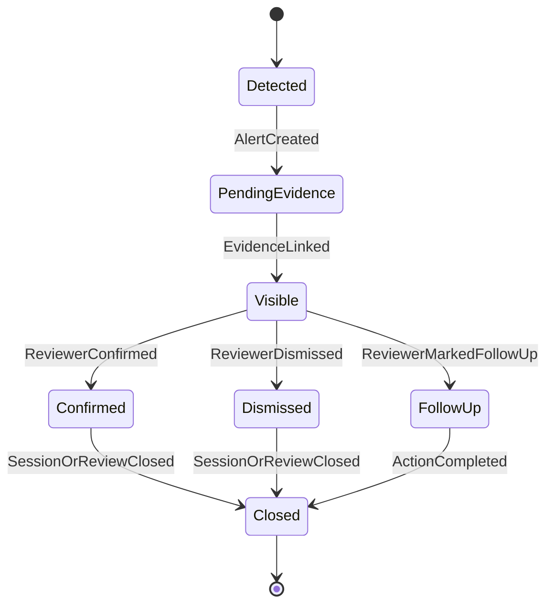
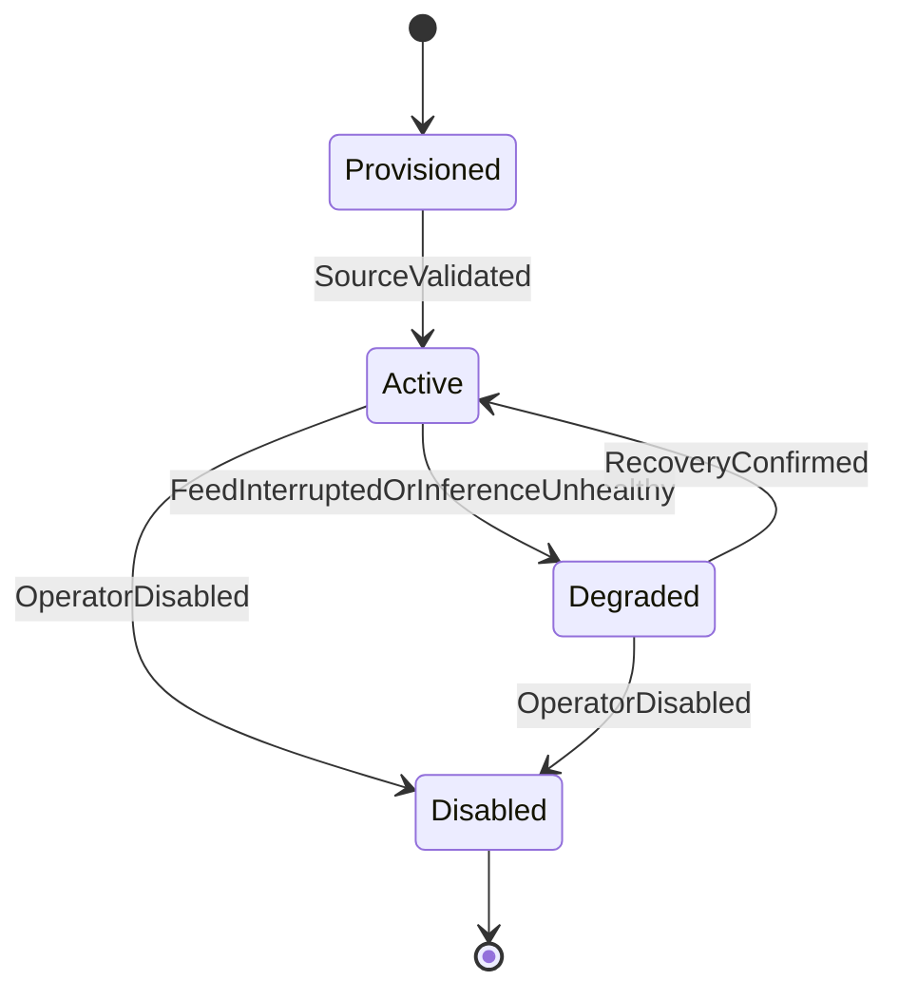
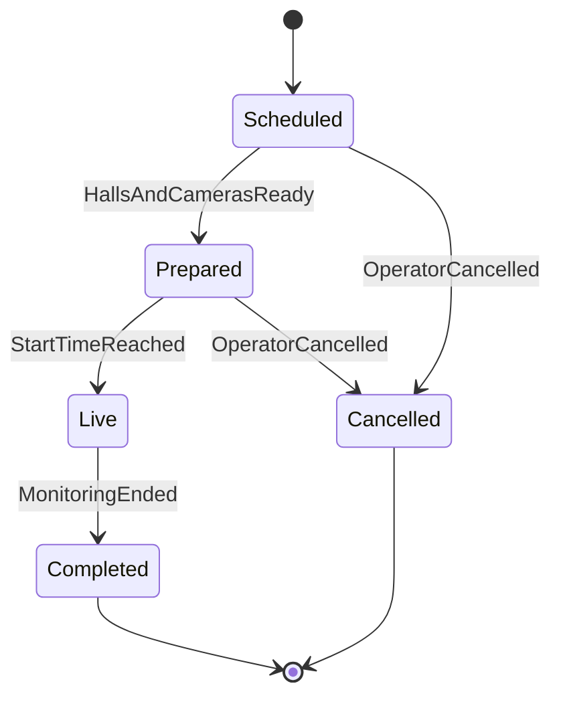
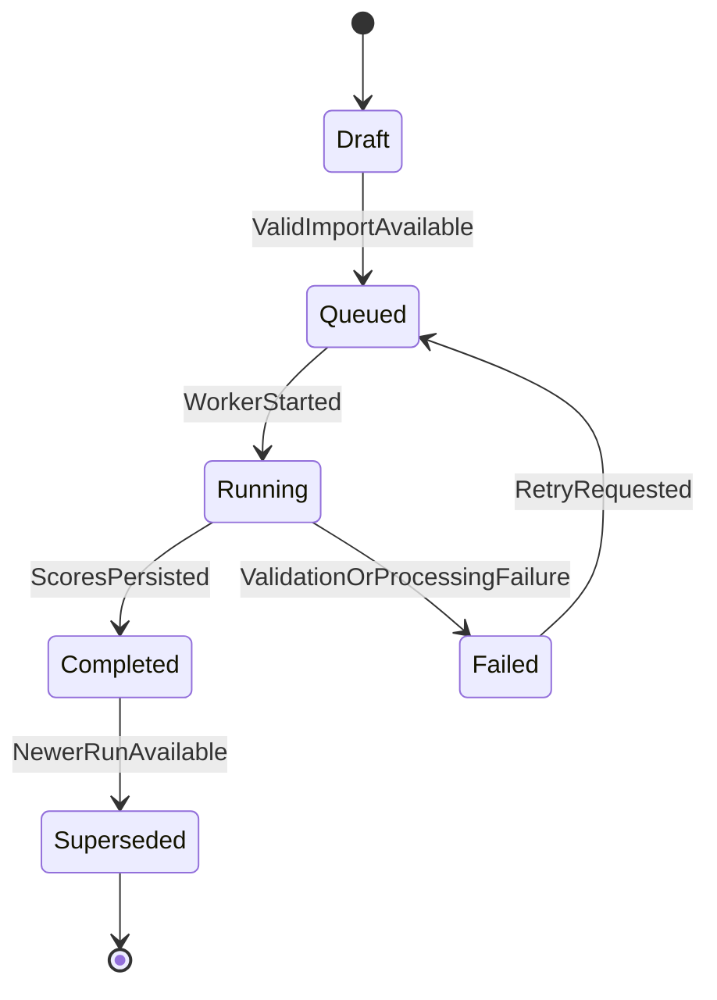
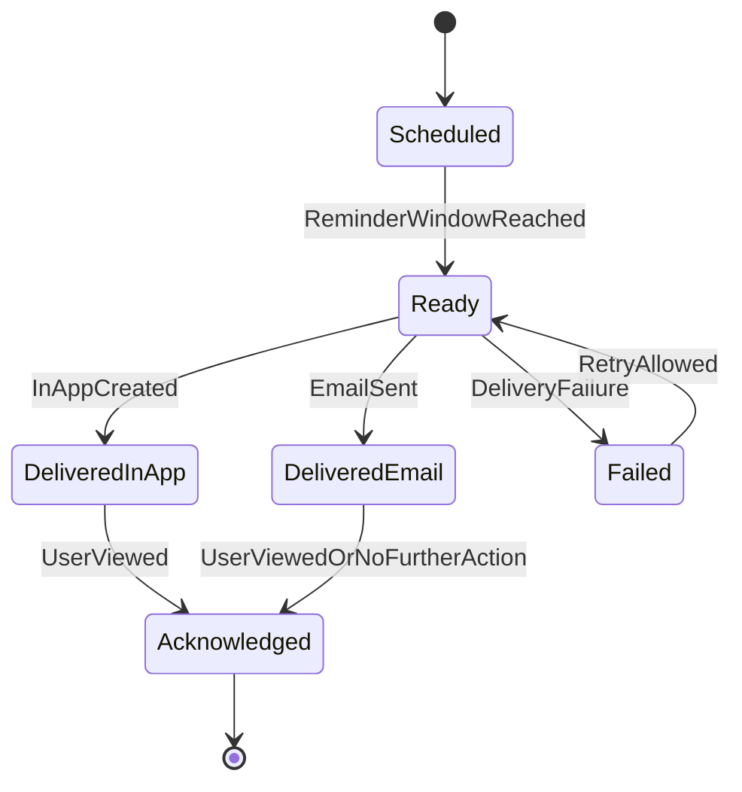
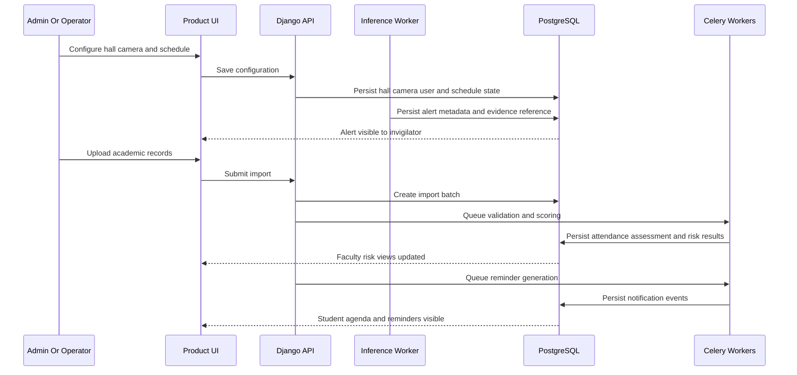

# Sightline Phase 1 - Domain Workflows And Data

## 1) Purpose

This document explains the domain model, user workflows, lifecycle states, data ownership boundaries, and correctness properties for phase 1.

It should be readable by:

- engineers implementing backend, inference, and UI workflows
- product stakeholders validating user-visible behavior
- operators who need to understand how alerts, imports, schedules, and reminders move through the system

## 2) End-To-End User Workflows

The platform has three primary phase-1 journeys:

- `configure -> monitor exam -> review alert -> take action`
- `import academic data -> calculate risk -> review at-risk students -> intervene`
- `manage schedule -> generate reminders -> student views agenda -> attends exam or class`

## 3) Workflow Notes

- `Configuration` is the operational front door for hall, user, schedule, and import setup.
- `Exam monitoring` creates time-sensitive alerts, but the user-visible outcome is reviewable suspicion, not a cheating verdict.
- `Risk analytics` turns imported academic records into interpretable student and department views.
- `Schedules and reminders` make academic events visible and proactive for students.
- `Shared platform state` connects users, courses, semesters, roles, notifications, and audit history across all modules.

## 4) Core Domain Entities

- `Hall`: a physical exam hall or academic location monitored or scheduled by the platform
- `Camera`: a configured video source associated with a hall
- `Seat`: a seat region or desk position within a hall
- `ExamSession`: a scheduled exam event being monitored
- `AlertEvent`: a visible suspicious-behavior alert tied to a time window and context
- `EvidenceAsset`: a snapshot, clip, or other retained evidence for an alert
- `ReviewerAction`: a durable record of a reviewer decision on an alert
- `Department`: an organizational academic unit
- `Course`: a course or subject within a department or semester context
- `Semester`: an academic period used for schedules, analytics, and reporting boundaries
- `StudentProfile`: the canonical student record used across schedules, analytics, and notifications
- `FacultyProfile`: the canonical faculty or department-head record used across courses and analytics views
- `AcademicRecordImport`: a submitted attendance or assessment import with validation outcome
- `AttendanceRecord`: attendance data tied to a student, course, and period
- `AssessmentRecord`: quiz, midterm, or other scored assessment data tied to a student and course
- `RiskAssessmentRun`: a durable run that calculates risk outputs from available academic data
- `StudentRiskScore`: the resulting risk output for a student in a course or cohort context
- `ClassSchedule`: a scheduled teaching event
- `ExamSchedule`: a scheduled exam event
- `ReminderRule`: a rule describing when reminders should be generated for an event type
- `NotificationEvent`: a reminder or system notification visible or deliverable to a user

## 5) Entity Relationship Diagram

## 6) Lifecycle Models

### 6.1 Alert Event Lifecycle

### 6.2 Camera Lifecycle

### 6.3 Exam Session Lifecycle

### 6.4 Risk Assessment Run Lifecycle

### 6.5 Notification Lifecycle

## 7) Data Ownership Boundaries

### Video and inference evidence

Owned by:

- inference worker runtime
- evidence generation pipeline
- object storage

Examples:

- source stream metadata
- per-frame detection summaries
- alert snapshots
- alert replay clips

### Canonical product state

Owned by:

- Django control plane
- PostgreSQL
- audit and review services

Examples:

- halls, cameras, seats
- exam sessions
- alerts and reviewer actions
- users, roles, departments, courses, semesters

### Academic analytics state

Owned by:

- import processing workers
- analytics services
- PostgreSQL

Examples:

- import batches
- attendance records
- assessment records
- risk runs and risk scores

### Scheduling and reminder state

Owned by:

- scheduling services
- reminder workers
- Django notification services

Examples:

- class schedules
- exam schedules
- reminder rules
- notification events

## 8) Normalized Event Contracts

### Alert event contract

Every visible exam-monitoring alert should normalize into a common alert shape:

- `alertId`
- `alertType`
- `occurredAt`
- `examSessionId`
- `hallId`
- `cameraId`
- `seatId` or `studentId` when available
- `confidenceScore`
- `visibilityQuality`
- `evidenceAssetIds`
- `status`

### Risk result contract

Every durable risk run should normalize into a common scoring shape:

- `riskRunId`
- `studentId`
- `courseId`
- `semesterId`
- `riskLevel`
- `riskScore`
- `contributingFactors`
- `generatedAt`
- `sourceImportIds`

### Reminder event contract

Every reminder should normalize into a common notification shape:

- `notificationId`
- `recipientUserId`
- `eventType`
- `scheduleId`
- `channel`
- `scheduledFor`
- `generatedAt`
- `deliveryState`
- `idempotencyKey`

## 9) Cross-Module Data Flow

## 10) Correctness Properties

These invariants must hold even as implementation evolves.

| ID | Property | What It Means |
| --- | --- | --- |
| CP-01 | One suspicious event creates one canonical visible alert | Prevent duplicate user-visible noise for the same event window |
| CP-02 | No meaningful suspicious behavior produces no visible alert | Thresholding should suppress weak or transient events |
| CP-03 | Reviewer decisions are durable and auditable | Confirm, dismiss, and follow-up actions remain inspectable |
| CP-04 | Evidence remains linked to the alert it explains | Alert context must not drift away from its retained evidence |
| CP-05 | Imported records map consistently to one student, course, and semester context | Analytics correctness depends on stable identity mapping |
| CP-06 | One risk run produces one coherent set of student risk outputs for its scoped data | Prevent mixed or partially overwritten analytics state |
| CP-07 | Reminder generation is idempotent by event window and user | Duplicate reminders should not be produced for the same schedule window |
| CP-08 | Operational health changes alter user-visible state | Degraded cameras, workers, or imports must not remain hidden |

## 11) Product-Level Domain Rules

- `AlertEvent` represents suspicious behavior that requires human review, not a cheating verdict.
- `ReviewerAction` does not erase the alert; it explains how the alert was handled.
- `EvidenceAsset` is durable reference material, not a replacement for the alert record.
- `AcademicRecordImport` is the boundary between raw uploaded files and validated academic records.
- `RiskAssessmentRun` produces interpretable outputs and should be traceable to the data used.
- `ClassSchedule` and `ExamSchedule` are separate sources of student obligations but must be mergeable in the agenda view.
- `ReminderRule` defines when notifications should be generated, not whether a schedule item exists.
- `NotificationEvent` is the durable record of reminder generation and delivery state.

## 12) What This Domain Model Optimizes For

- live reviewable exam supervision
- durable and auditable faculty decision support
- low-friction student schedule awareness
- one shared platform model across three user-facing modules
- future integrations and model changes without breaking the user-facing concepts
