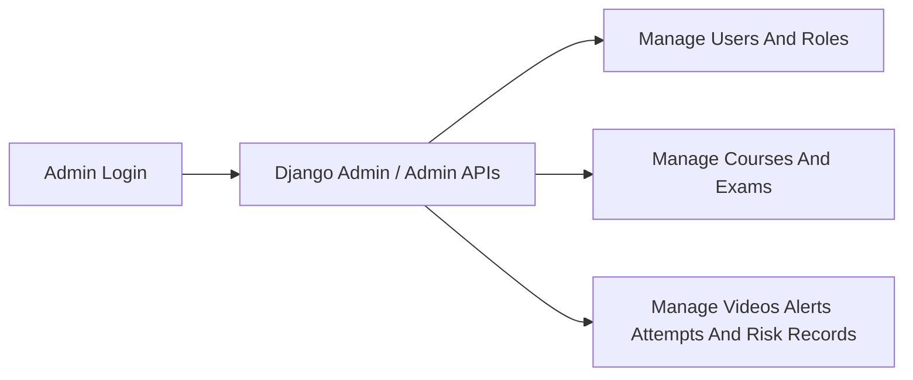
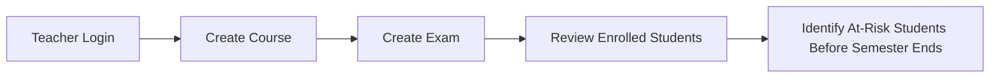
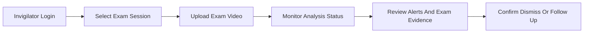
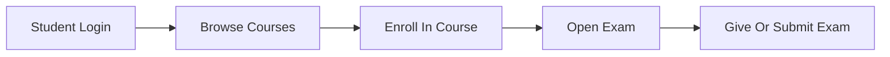
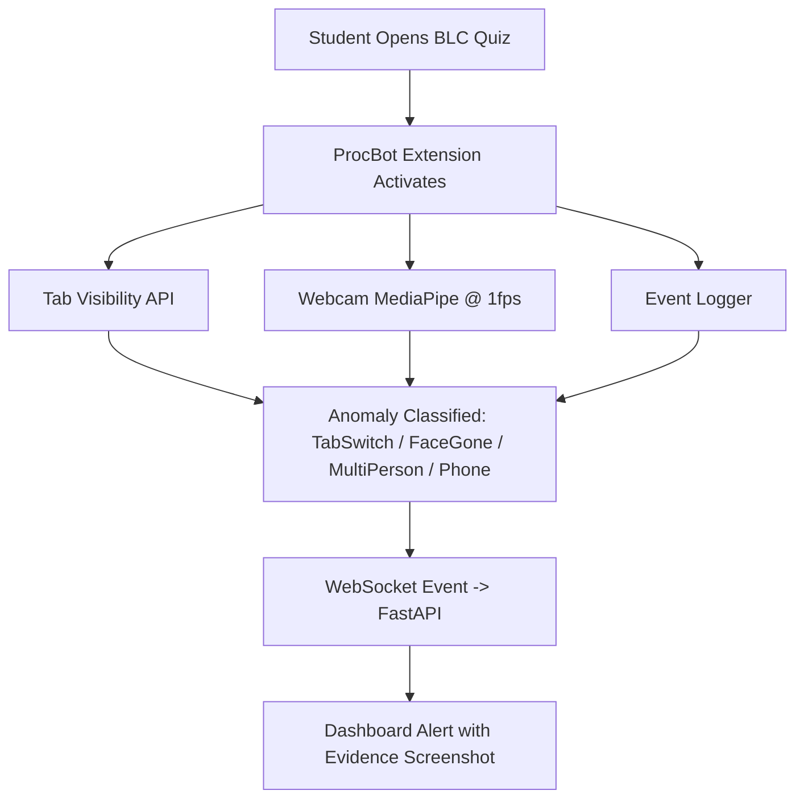
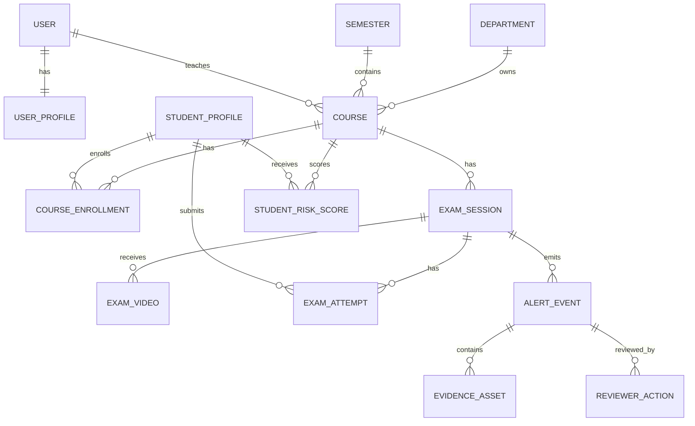

# Sightline MVP - Domain Workflows And Data

## 1) Purpose

This document describes the MVP workflows, domain entities, and data rules for Sightline.

The MVP should stay simple: one Django backend, a minimal frontend, Django admin for deep management, and role-specific APIs for the first product workflows.

## 2) Roles And Workflows

### Admin workflow

Admin manages everything through Django admin and admin APIs.

### Teacher workflow

Teacher creates courses, creates exams, uploads course material if needed, and identifies academically at-risk students before the semester ends.

### Invigilator workflow

Invigilator uploads exam videos and monitors/reviews and alerts exam evidence.

### Student workflow

Student enrolls in courses and gives/submits exams.

## 3) ProcBot Browser Monitoring Workflow

ProcBot is the browser-monitoring workflow for BLC quizzes.

| Detection | Method | Cost | Cadence |
| --- | --- | --- | --- |
| TabSwitch | Browser API | Extremely low | Realtime |
| FaceGone | MediaPipe Face Detector | Low | Every 5 sec |
| MultiPerson | MediaPipe Face Detector | Low | Every 5 sec |
| Phone | ONNX/WebGPU tiny model | Medium | Every 15-20 sec |

Cadence rules:

- Realtime: tab switch only.
- Every 5 sec: face detection and multi-person detection.
- Every 15-20 sec: phone detection.

## 4) Core Domain Entities

Keep the model count low. Prefer extending existing entities before adding new tables.

| Entity | Purpose |
| --- | --- |
| `User` | Django auth identity. |
| `UserProfile` | Stores one role: `admin`, `teacher`, `invigilator`, or `student`. |
| `Department` | Academic grouping for users and courses. |
| `Semester` | Academic time period. |
| `Course` | Teacher-owned course. |
| `CourseEnrollment` | Student enrollment in a course. |
| `ExamSession` | Scheduled exam for a course. |
| `ExamVideo` | Uploaded video for an exam session. |
| `ExamAttempt` | Student exam attempt/submission. |
| `AlertEvent` | Suspicious event requiring human review. |
| `EvidenceAsset` | Snapshot, screenshot, clip, or file reference explaining an alert. |
| `ReviewerAction` | Invigilator decision on an alert. |
| `StudentRiskScore` | Teacher-facing at-risk result for a student/course. |

## 5) Entity Relationship Summary

## 6) Data Rules

- One user has one Sightline role.
- Admin can access and manage all records.
- Teacher can manage their own courses and exams.
- Teacher risk views should be scoped to the teacher's course unless admin.
- Student can only manage their own enrollments and attempts.
- Invigilator can upload videos and review alerts/evidence, but does not decide disciplinary outcomes.
- Alerts are reviewable suspicion records, not cheating verdicts.
- Evidence remains linked to the alert it explains.
- ProcBot events should normalize into the same alert/evidence review concept when implemented.

## 7) Normalized Event Contracts

### Uploaded video alert

- `alertId`
- `alertType`
- `occurredAt`
- `examSessionId`
- `videoId`
- `confidenceScore`
- `evidenceAssetIds`
- `status`

### ProcBot alert

- `alertId`
- `studentId`
- `quizId`
- `alertType`: `TabSwitch`, `FaceGone`, `MultiPerson`, or `Phone`
- `occurredAt`
- `evidenceScreenshotId`
- `confidenceScore` when available
- `status`

### Student risk result

- `riskScoreId`
- `studentId`
- `courseId`
- `riskLevel`
- `riskScore`
- `contributingFactors`
- `generatedAt`

## 8) Correctness Properties

| ID | Property |
| --- | --- |
| CP-01 | Role permissions prevent cross-role data access. |
| CP-02 | A student can only have one active enrollment per course. |
| CP-03 | A student can only have one active exam attempt per exam session. |
| CP-04 | Alert records are not deleted by review actions. |
| CP-05 | Evidence remains linked to the alert it explains. |
| CP-06 | Teacher risk outputs are interpretable and scoped to a course. |
| CP-07 | ProcBot runs cheap checks more frequently than expensive checks. |

