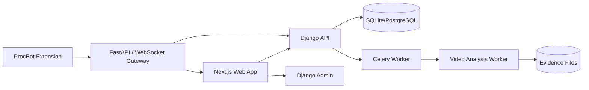
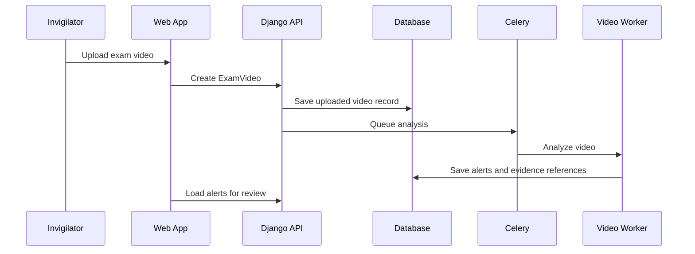
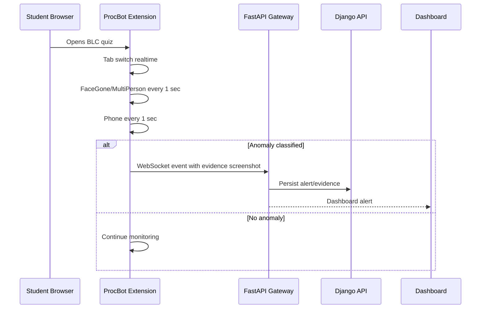

# Sightline MVP - System Architecture

## 1) Architecture Principles

| Principle | Why It Matters |
| --- | --- |
| `Keep the MVP small` | Build the workflows that prove value first. |
| `Django owns product state` | Users, roles, courses, exams, videos, attempts, alerts, and risk records need one source of truth. |
| `Human review stays central` | Alerts and risk outputs support people; they do not make final decisions. |
| `Use admin before custom UI` | Django admin is enough for many admin workflows in the MVP. |
| `Cost-aware monitoring` | ProcBot should use lightweight in-browser detectors at the required cadence. |

## 2) Runtime Shape

For local MVP development, SQLite is acceptable. PostgreSQL, Redis, object storage, and a separate FastAPI/WebSocket gateway can be added as deployment maturity increases.

## 3) Modules

| Module | Responsibility |
| --- | --- |
| `Next.js Web App` | login, role dashboard, lightweight admin/user surfaces, calls `/api/v1`. |
| `Django Admin` | full management surface for admin users. |
| `Django API` | auth, role checks, serializers, class-based views, product APIs. |
| `Django Models` | canonical product state. |
| `Celery Worker` | async jobs such as video analysis and risk scoring. |
| `Video Analysis Worker` | analyzes uploaded exam videos and emits alert/evidence records. |
| `ProcBot Extension` | browser-side BLC quiz monitoring. |
| `FastAPI/WebSocket Gateway` | receives ProcBot anomaly events and pushes dashboard alerts. |

## 4) Core API Expectations

- `/auth/login` signs a user in.
- `/auth/logout` signs a user out.
- `/api/v1/me` returns the current user and role.
- `/api/v1/courses` supports teacher course creation and student course discovery.
- `/api/v1/enrollments` supports student enrollment.
- `/api/v1/exams` supports teacher exam creation.
- `/api/v1/exam-attempts` supports student exam submission.
- `/api/v1/exam-videos` supports invigilator video upload.
- `/api/v1/risk-runs` supports teacher at-risk analysis.
- `/api/v1/admin/...` supports admin-only management.

## 5) Uploaded Video Flow

## 6) ProcBot Browser Flow

## 7) ProcBot Detection Cadence

| Detection | Method | Cost | Cadence |
| --- | --- | --- | --- |
| TabSwitch | Browser API | Extremely low | Realtime |
| FaceGone | MediaPipe BlazeFace Short-Range FP16 | Low | Every 1 sec |
| MultiPerson | MediaPipe BlazeFace Short-Range FP16 | Low | Every 1 sec |
| Phone | MediaPipe EfficientDet-Lite0 INT8 | Low | Every 1 sec |

## 8) Boundaries

- Django remains authoritative for users, roles, courses, exams, enrollments, attempts, alerts, and review state.
- The video worker and ProcBot classify anomalies but do not decide misconduct.
- Evidence files can live outside the database, but database records must reference them.
- The frontend should not invent role permissions; it should reflect backend authorization.

