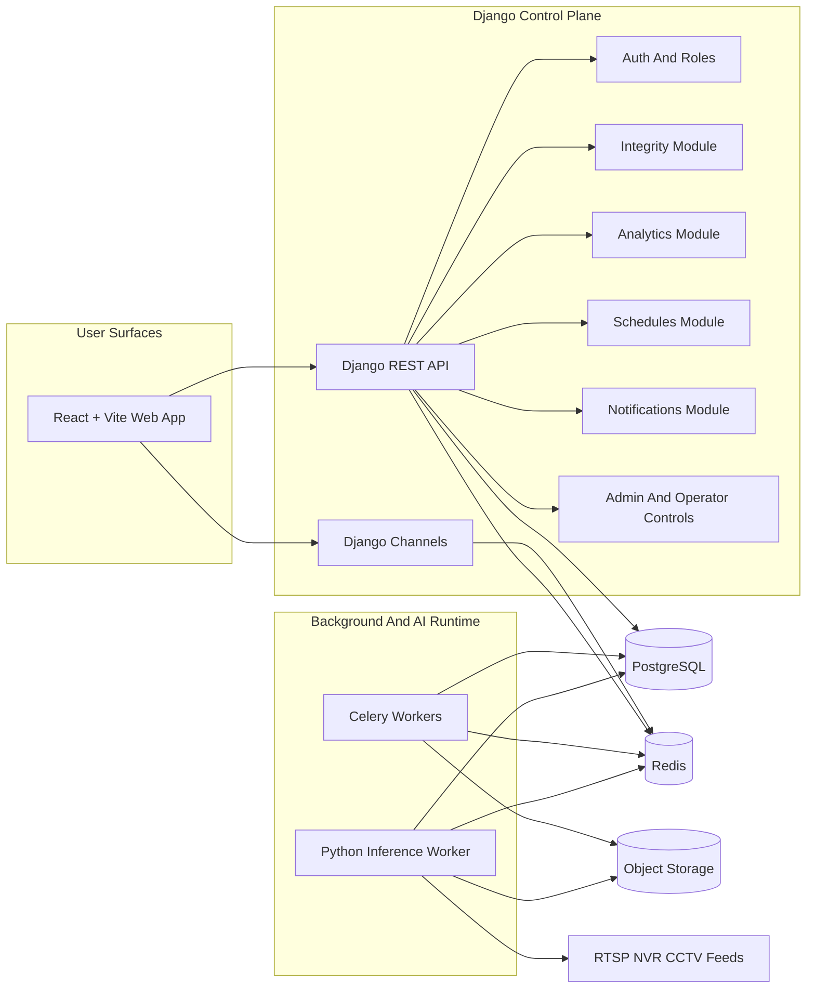
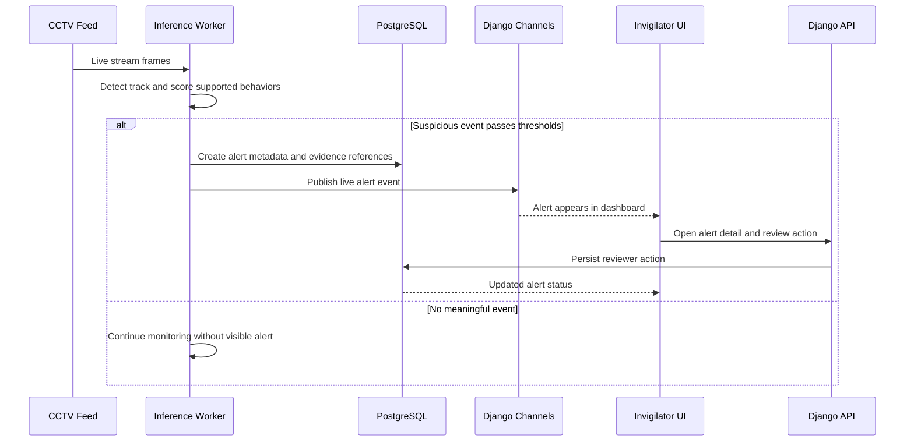
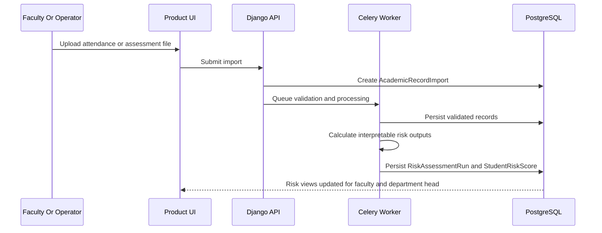
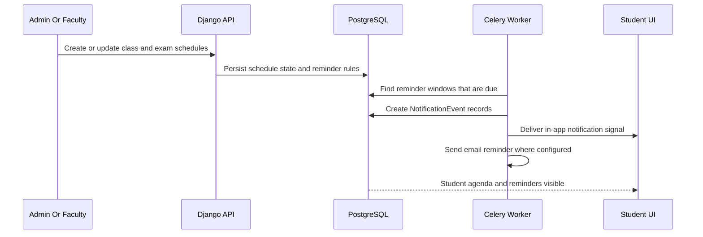
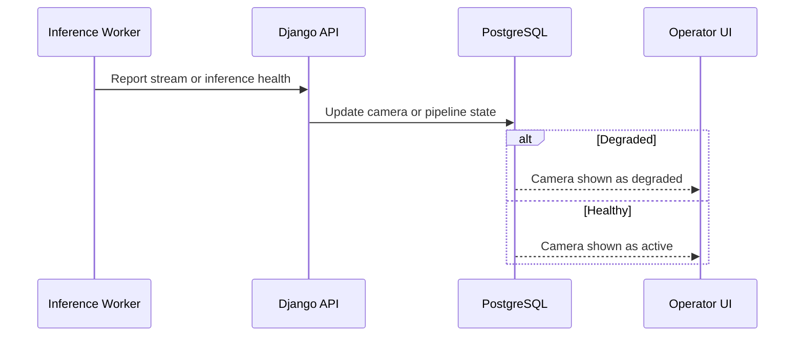

# Sightline Phase 1 - System Architecture

## 1) Architecture Principles

| Principle | Why It Matters |
| --- | --- |
| `Human review stays central` | The system surfaces suspicious behavior and risk indicators, but people make the consequential decisions |
| `Django owns product state` | Canonical business state, access control, APIs, and audit trails should live in one authoritative backend |
| `AI stays off the request path` | Live inference and heavy processing must not block normal web requests |
| `One platform, role-based surfaces` | Exam monitoring, analytics, and reminders should share users, schedules, and audit state |
| `Background work is durable and inspectable` | Imports, reminders, and evidence generation need retryable worker workflows |
| `Trust is visible` | Confidence, degraded states, evidence, and data freshness must be surfaced in the product |

## 2) Architecture Style

The platform uses a `Django-controlled modular architecture` with:

- a single `React + Vite` web app for all user-facing surfaces
- a Django control plane for product state, APIs, auth, and audit history
- `Django Channels` for WebSocket-based live alerts and notifications
- `Celery + Redis` for asynchronous jobs such as imports, reminders, and evidence processing
- a separate Python inference worker for exam-monitoring pipelines
- `PostgreSQL` as the canonical system of record
- object storage for evidence snapshots and replay clips

This is not a microservices-first design. It is one platform with explicit runtime boundaries where those boundaries reduce risk or latency.

## 2.1) Repo Layout Proposal

The initial repository layout should support the chosen stack cleanly:

- `apps/api-django`
- `apps/web-react`
- `apps/worker-inference`
- `docs/product`
- `infra`
- `migrations`

Within the Django application, keep product modules explicit:

- `core`
- `integrity`
- `analytics`
- `schedules`
- `notifications`
- `operations`

## 3) High-Level System Layout

## 4) Module Responsibilities

| Module | What It Does | Key Responsibilities |
| --- | --- | --- |
| `React Web App` | all user-facing surfaces | login, dashboards, alert review, faculty analytics, schedules, student reminders, admin views |
| `Django API` | main product entrypoint | REST APIs, permissions, validation, orchestration, audit boundary |
| `Auth And Roles` | identity and access control | users, roles, department mapping, route and action authorization |
| `Integrity Module` | live exam supervision product behavior | halls, cameras, seats, exam sessions, alert state, reviewer actions |
| `Analytics Module` | at-risk student decision support | imports, validation outcomes, risk runs, student and department views |
| `Schedules Module` | academic event modeling | class schedules, exam schedules, merged agenda logic |
| `Notifications Module` | reminder and system notification behavior | reminder rules, notification events, email and in-app delivery state |
| `Admin And Operator Controls` | operational visibility and configuration | hall setup, camera setup, import oversight, worker health, degraded-state views |
| `Celery Workers` | asynchronous product work | import validation, risk calculation, reminder generation, email delivery, evidence post-processing |
| `Inference Worker` | live computer vision execution | stream ingestion, tracking, behavior scoring, alert emission, evidence extraction |
| `Object Storage` | retained evidence | snapshots, alert clips, optionally preprocessed evidence bundles |

## 5) PostgreSQL vs Redis vs Object Storage Responsibilities

### PostgreSQL is authoritative for

- users and roles
- halls, cameras, seats
- exam sessions and alerts
- reviewer actions and audit trails
- courses, departments, semesters
- academic imports and normalized records
- risk assessment runs and student risk scores
- class schedules and exam schedules
- reminder rules and notification events
- operational health states that matter to users

### Redis is non-authoritative for

- channel layers for WebSockets
- Celery broker or transient job coordination
- short-lived event fan-out
- ephemeral counters and worker coordination

If Redis becomes unavailable, the system should degrade in responsiveness, not lose canonical truth.

### Object storage is authoritative for

- evidence snapshots
- evidence clips
- large retained media artifacts referenced by alerts

Object storage is not the source of truth for alert status or reviewer decisions. Those remain in PostgreSQL.

## 6) Core Runtime Flows

### 6.1 Alert Generation And Review Flow

### 6.2 Faculty Import To Risk Flow

### 6.3 Schedule To Reminder Flow

### 6.4 Camera Health Flow

## 7) Scheduling And Background-Processing Rules

The platform has multiple schedulers, but each one should remain explicit:

- `Exam monitoring` is event-driven by live video streams and should not depend on HTTP-triggered polling
- `Reminder generation` is a durable background schedule based on event times and reminder rules
- `Academic imports` are asynchronous jobs triggered by user submission
- `Risk runs` are asynchronous jobs triggered by successful data validation or explicit rerun requests
- `Health monitoring` is periodic or event-driven status reporting from workers and camera integrations

This logic belongs in Django-managed durable state plus Celery orchestration, not hidden browser timers or ad hoc cron scripts.

## 8) Correctness Boundaries

| Boundary | Rule |
| --- | --- |
| Django control plane | owns canonical business state, permissions, APIs, and audit history |
| Inference worker | never decides disciplinary outcome and never owns final reviewer state |
| Celery workers | execute retryable asynchronous jobs but do not replace canonical state management |
| Redis | supports messaging and responsiveness, not canonical truth |
| Object storage | holds evidence artifacts, not alert lifecycle state |
| React UI | reflects durable platform state and explicit live events, not hidden worker assumptions |

## 9) Why This Architecture Fits Phase 1

- supports a single role-based web platform instead of fragmented tools
- keeps live AI workloads away from normal web requests
- gives Django strong ownership of business state and auditability
- makes reminders, imports, and analytics naturally asynchronous
- preserves a clean path for on-prem deployment with RTSP camera access
- keeps evidence, health visibility, and human review central to the product
