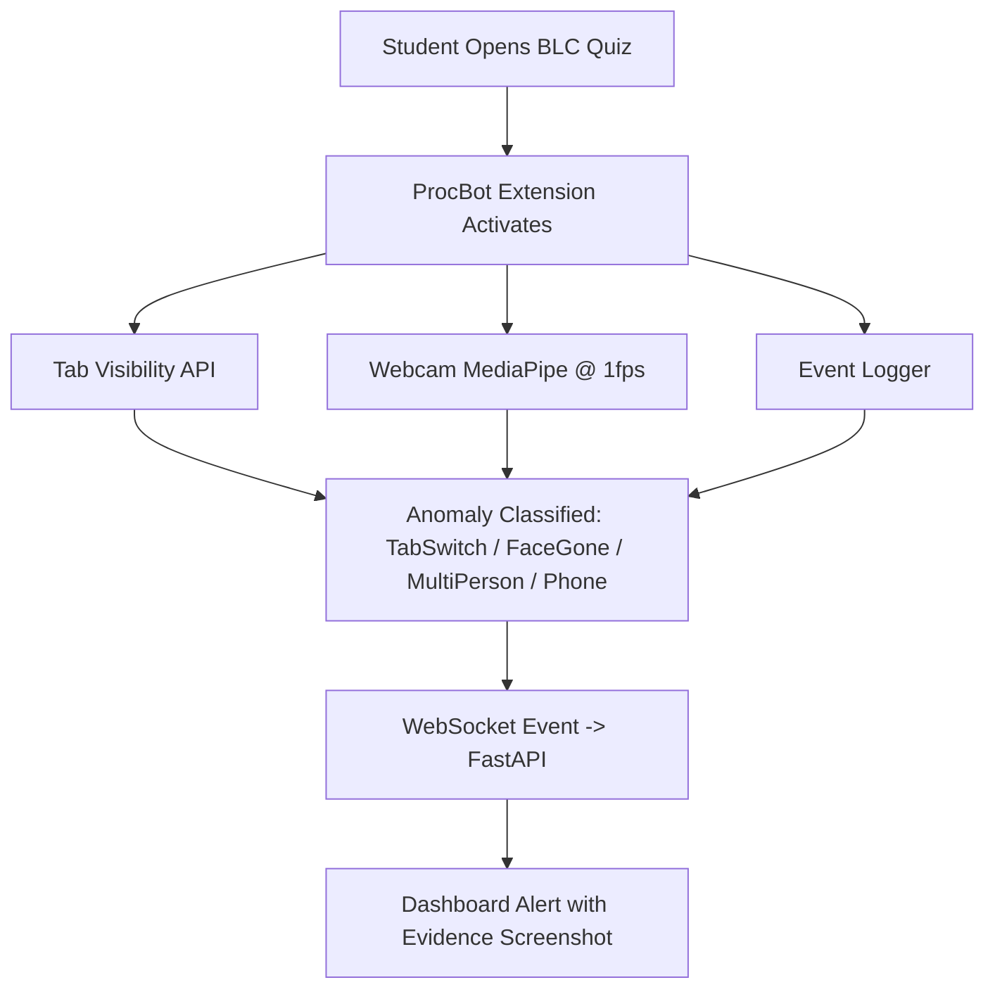

# Product Documentation

This folder is the MVP source of truth for Sightline.

Read in order:

1. [Product requirements](./01-product-requirements.md)
2. [Domain workflows and data](./02-domain-workflows-and-data.md)
3. [System architecture](./03-system-architecture.md)
4. [Delivery, validation, and roadmap](./04-delivery-validation-and-roadmap.md)
5. [MVP funding feature overview](./05-mvp-funding-feature-overview.md)

## MVP Summary

The MVP is deliberately narrow:

- Admin manages everything through Django admin and admin APIs.
- Teacher creates courses, creates exams, uploads course material if needed, and identifies academically at-risk students before the semester ends.
- Invigilator uploads exam videos and monitors/reviews and alerts exam evidence.
- Student enrolls in courses and gives/submits exams.

The only product roles for MVP are `admin`, `teacher`, `student`, and `invigilator`.

Uploaded exam videos are the first exam-integrity input. Live CCTV/RTSP camera monitoring is not required for the first build.

## Additional Requirement: ProcBot

ProcBot is the browser-monitoring pipeline for BLC quizzes:

| Detection | Method | Cost | Cadence |
| --- | --- | --- | --- |
| TabSwitch | Browser API | Extremely low | Realtime |
| FaceGone | MediaPipe BlazeFace Short-Range FP16 | Low | Every 1 sec |
| MultiPerson | MediaPipe BlazeFace Short-Range FP16 | Low | Every 1 sec |
| Phone | MediaPipe EfficientDet-Lite0 INT8 | Low | Every 1 sec |

Build order should still favor the smallest shippable MVP first, then ProcBot.

