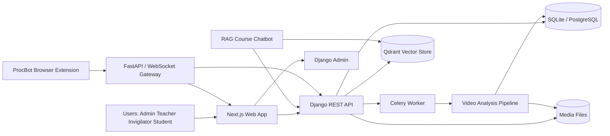
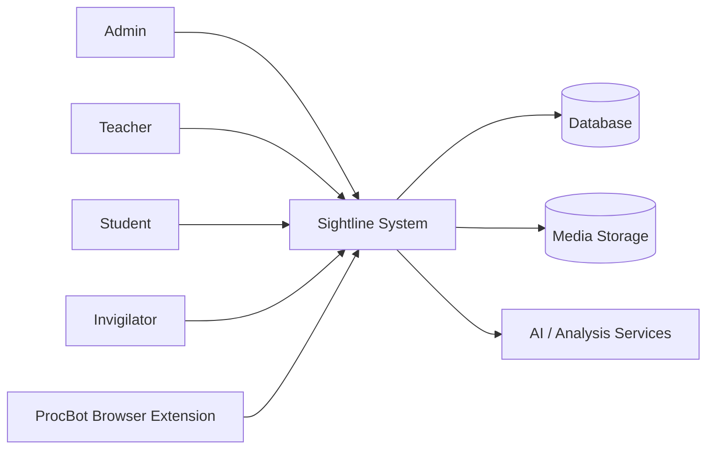
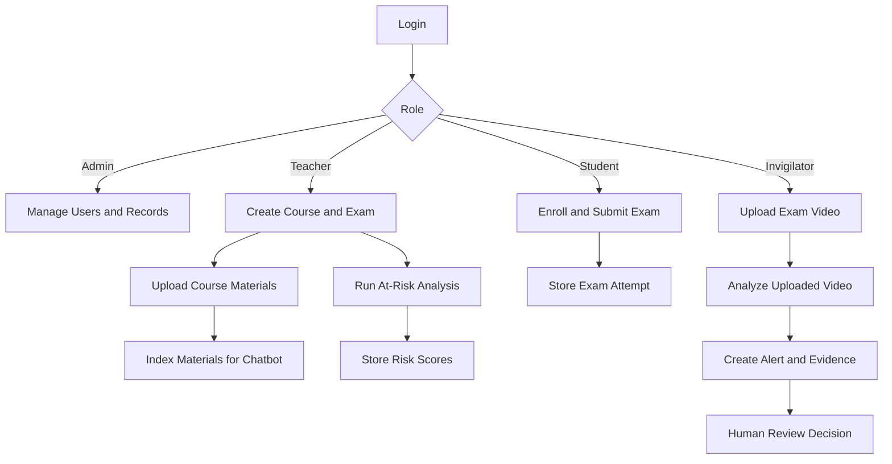
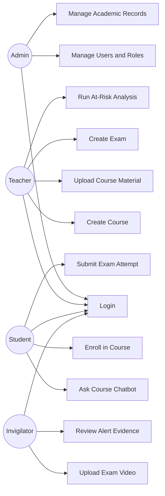
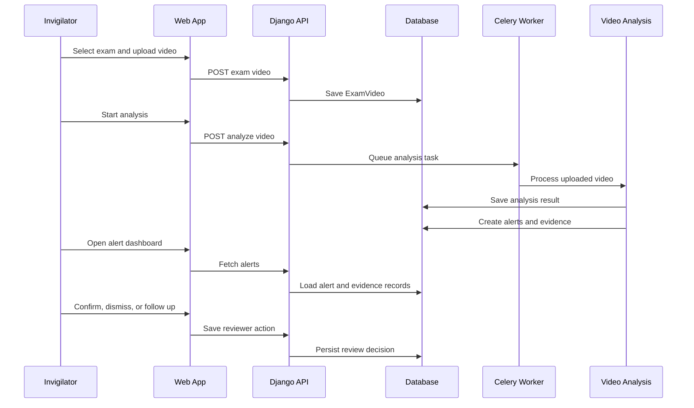
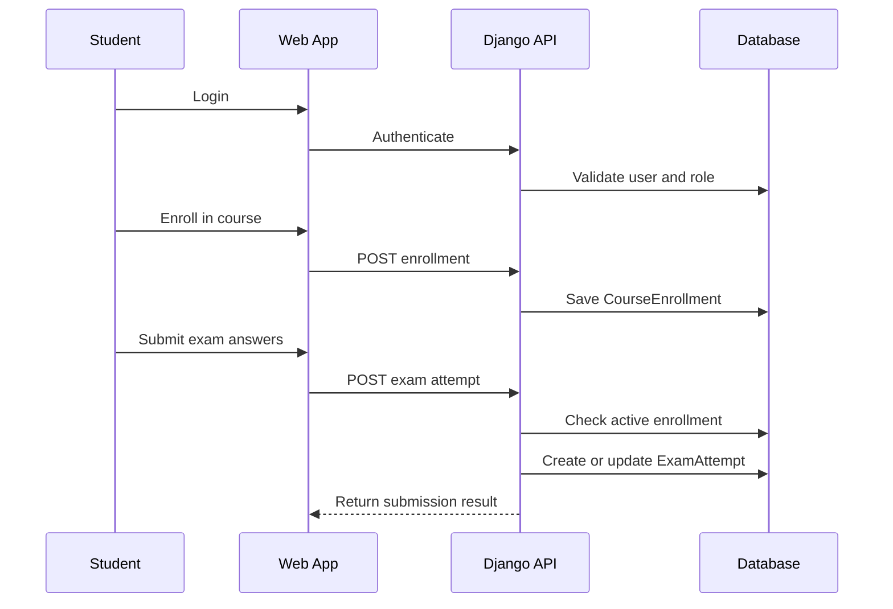
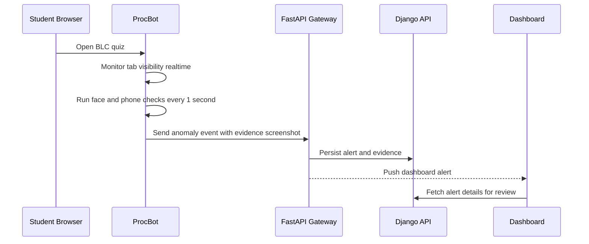

# Sightline Project Documentation

## 1. Project Title

**Sightline: AI-Assisted Academic Exam Integrity and Student Support System**

### Submission Information

| Field | Value |
| --- | --- |
| Project name | Sightline |
| Project type | Academic exam workflow, exam integrity, and student support platform |
| Documentation type | Project submission documentation |
| Prepared date | June 2026 |
| Primary users | Admin, teacher, invigilator, student |

## 2. Abstract

Sightline is an academic exam workflow and student support platform designed for universities and colleges. The system helps administrators manage academic users and setup data, helps teachers create courses and exams, allows students to enroll in courses and submit exams, supports invigilators in reviewing uploaded exam videos, and helps teachers identify academically at-risk students before the semester ends.

The project follows a responsible AI approach. AI and computer-vision modules can identify suspicious events or learning-support context, but the system does not make automatic cheating or disciplinary decisions. Instead, Sightline creates reviewable alerts, evidence records, and risk outputs so teachers and invigilators can make informed human decisions.

The MVP also includes a planned browser-monitoring requirement called ProcBot for BLC quizzes. ProcBot is designed to detect tab switching in realtime and webcam-based anomalies such as missing face, multiple people, and phone presence at a 1-second cadence.

## Table of Contents

| Section | Title |
| --- | --- |
| 1 | Project Title |
| 2 | Abstract |
| 3 | Problem Statement |
| 4 | Project Objectives |
| 5 | Scope |
| 6 | Stakeholders and User Roles |
| 7 | Major Features |
| 8 | System Architecture |
| 9 | Repository Structure |
| 10 | Entity Relationship Diagram |
| 11 | Main Data Entities |
| 12 | Database Design Summary |
| 13 | Data Flow Diagrams |
| 14 | Use Case Diagram |
| 15 | Sequence Diagrams |
| 16 | API Overview |
| 17 | Role Permission Matrix |
| 18 | Technology Stack |
| 19 | Local Setup Summary |
| 20 | Deployment Summary |
| 21 | Testing and Validation |
| 22 | Security and Privacy Considerations |
| 23 | Responsible AI Considerations |
| 24 | Limitations |
| 25 | Future Enhancements |
| 26 | Conclusion |
| 27 | References |

## 3. Problem Statement

Educational institutions often face two connected problems:

1. Exam integrity review is time-consuming, manual, and difficult to audit.
2. Teachers may not identify academically at-risk students early enough to provide support before final exams.

Traditional review processes require invigilators or teachers to manually inspect long exam recordings, compare student activity, and record findings. This takes time and may be inconsistent. At the same time, students who are struggling may remain unnoticed until their final performance is already affected.

Sightline addresses these problems by combining role-based academic workflows, exam evidence management, AI-assisted video analysis, and student risk support into one MVP platform.

## 4. Project Objectives

The main objectives of Sightline are:

- Provide a role-based academic platform for admins, teachers, invigilators, and students.
- Allow teachers to create courses, organize course materials, and create exams.
- Allow students to enroll in courses and submit exam attempts.
- Allow invigilators to upload exam videos and review suspicious alert evidence.
- Store alert evidence, review decisions, timestamps, and confidence scores for auditability.
- Help teachers identify academically at-risk students using attendance and assessment records.
- Support course-aware student learning through a RAG course chatbot.
- Prepare a lightweight browser-monitoring workflow for BLC quizzes through ProcBot.
- Keep AI outputs explainable and human-reviewed rather than automatic punishment.

## 5. Scope

### 5.1 In Scope

| Area | Included Scope |
| --- | --- |
| Authentication | Password login and session-based access |
| Roles | Admin, teacher, invigilator, and student |
| Admin management | User, role, course, exam, video, alert, and risk data management |
| Teacher workflows | Course creation, exam creation, course-material upload, risk review |
| Student workflows | Course enrollment and exam attempt submission |
| Invigilator workflows | Exam-video upload, analysis monitoring, alert review |
| Video analysis | Uploaded video processing, alert generation, evidence storage |
| Evidence review | Confirm, dismiss, or follow up on alerts |
| Academic risk | Student risk scores with contributing factors |
| Course chatbot | Course-material retrieval and course-aware Q&A |
| ProcBot plan | Browser anomaly detection for BLC quizzes |

### 5.2 Out of Scope for the MVP

- Live CCTV or RTSP monitoring.
- Fully automated cheating verdicts.
- Disciplinary automation.
- Complete LMS/SIS integration.
- Mobile application.
- Full proctoring operations center.
- SMS or push notification system.

## 6. Stakeholders and User Roles

| Role | Main Responsibility |
| --- | --- |
| Admin | Manages platform users, roles, academic setup, records, and system data. |
| Teacher | Creates courses and exams, uploads course materials, and reviews at-risk students. |
| Invigilator | Uploads exam videos, monitors analysis results, and reviews alert evidence. |
| Student | Enrolls in courses, studies course materials, and submits exam attempts. |

## 7. Major Features

### 7.1 Authentication and Role-Based Access

Sightline supports password login and role-aware access. Each user has one Sightline role stored in the user profile. Backend authorization checks ensure users only access the actions allowed for their role.

Key points:

- Admin can access all records.
- Teacher can manage only their own courses and exams unless they are admin.
- Student can enroll in courses and submit only their own exam attempts.
- Invigilator can upload videos and review alerts but cannot issue disciplinary decisions.

### 7.2 Admin Management

Admins can manage the platform through Django admin and admin APIs. This includes users, roles, departments, semesters, courses, exams, enrollments, videos, alerts, evidence, and operational records.

Admin features:

- Create and update users.
- Assign roles.
- Reset user passwords.
- Manage academic setup data.
- Review system records through Django admin.
- Access admin dashboard and management APIs.

### 7.3 Teacher Course Management

Teachers can create and manage their own courses. Each course belongs to a department and semester and can be associated with course units and materials.

Teacher course features:

- Create courses.
- Organize course units.
- Upload or enter course materials.
- Index course content for retrieval-based course chat.
- View students enrolled in their courses.

### 7.4 Teacher Exam Management

Teachers can create exams for their own courses. Exam sessions store timing, hall, status, quiz title, instructions, and quiz questions.

Exam features:

- Create exam sessions.
- Add quiz title and instructions.
- Store quiz questions.
- Restrict exam access to enrolled students.
- View submitted attempts for teacher-owned courses.

### 7.5 Course Material and RAG Chatbot

Sightline includes a course-aware chatbot that answers questions using uploaded course content. Course materials can include text, PDFs, documents, slides, URLs, and embedded resources. Materials are indexed into a vector store so relevant context can be retrieved for student questions.

RAG chatbot features:

- Upload or enter course materials.
- Organize materials by course and unit.
- Index material content.
- Retrieve relevant course context.
- Maintain course chat threads and messages.
- Provide citation-style context from course materials.

### 7.6 Student Enrollment

Students can browse available courses and enroll. The system creates a course enrollment record for each student-course pair.

Enrollment features:

- Enroll in a course.
- Maintain enrollment status such as active, dropped, or completed.
- Prevent duplicate enrollment for the same student and course.
- Use enrollment records to control exam access.

### 7.7 Student Exam Submission

Students can submit exam attempts for exams in courses where they are actively enrolled. A student can have one exam attempt per exam session.

Exam submission features:

- Submit answers as structured data.
- Update an existing attempt for the same exam session.
- Track attempt status such as started, submitted, or reviewed.
- Store submission timestamp.

### 7.8 Invigilator Exam Video Upload

Invigilators can upload exam videos for analysis. Uploaded videos are associated with exam sessions and stored with analysis status.

Video upload features:

- Upload exam video file.
- Store original filename and file URI.
- Track upload and analysis status.
- Store analysis start and completion times.
- Store analysis report and frame-processing metadata.

### 7.9 AI-Assisted Video Analysis

Sightline processes uploaded exam videos to identify reviewable suspicious events. The AI pipeline is designed to assist review, not to make final misconduct decisions.

Video analysis may detect:

- Repeated look-away behavior.
- Nearby-desk or neighboring-student context.
- Unauthorized device or phone presence.
- Other suspicious visual patterns that require human review.

Stored analysis output includes:

- Alert type.
- Timestamp.
- Confidence score.
- Summary.
- Evidence reference.
- Linked exam session and uploaded video.
- Analysis result metadata.

### 7.10 Alert and Evidence Review

Alerts are reviewable records, not final judgments. Invigilators can inspect evidence and mark alerts as confirmed, dismissed, or follow-up.

Alert review features:

- View alert list.
- Open alert details.
- See evidence snapshot or clip references.
- Record reviewer decision.
- Store reviewer note.
- Keep alert and evidence history for auditability.

### 7.11 Academic Risk Identification

Teachers can identify academically at-risk students before the semester ends. Risk analysis uses academic data such as attendance and assessment records to produce student-level risk scores and contributing factors.

Risk features:

- Import academic records.
- Store attendance and assessment data.
- Generate course-specific risk assessment runs.
- Calculate student risk score and risk level.
- Show contributing factors for interpretability.

### 7.12 Notifications and Agenda

The project includes notification and agenda support for class and exam schedules.

Notification features:

- Store class schedules and exam schedules.
- Define reminder rules.
- Generate notification events.
- Use idempotency keys to avoid duplicate notification records.

### 7.13 Operational Health Monitoring

Sightline stores operational health records for platform components such as inference, imports, reminders, and cameras or uploaded video sources.

Operational health features:

- Track component name and kind.
- Store healthy, degraded, or failed state.
- Store health message and last checked time.
- Support dashboard visibility into system status.

### 7.14 ProcBot Browser Monitoring

ProcBot is the planned browser-monitoring workflow for BLC quizzes. It runs in the student browser and sends anomaly events to the platform for review.

ProcBot detection plan:

| Detection | Method | Cadence |
| --- | --- | --- |
| TabSwitch | Browser Tab Visibility API | Realtime |
| FaceGone | MediaPipe face detection | Every 1 second |
| MultiPerson | MediaPipe face detection | Every 1 second |
| Phone | MediaPipe object detection | Every 1 second |

ProcBot events should become dashboard alerts with evidence screenshots and follow the same human-review pattern as uploaded video alerts.

## 8. System Architecture

Sightline uses a monorepo structure with a Django backend, Next.js frontend, background worker, and infrastructure configuration.



### 8.1 Main Components

| Component | Technology | Responsibility |
| --- | --- | --- |
| Web app | Next.js, React, TypeScript | Login, dashboard, admin surfaces, role workflows |
| API backend | Django, Django REST Framework | Auth, roles, models, serializers, product APIs |
| Admin panel | Django Admin | Full management of platform data |
| Database | SQLite locally, PostgreSQL for deployment | Persistent application data |
| Worker | Celery | Background tasks such as video analysis and indexing |
| Video AI | OpenCV, YOLOv8, MediaPipe | Uploaded video analysis and evidence generation |
| Vector store | Qdrant | Course material retrieval for RAG chatbot |
| Browser monitoring | ProcBot, WebSocket, FastAPI plan | BLC quiz anomaly capture |
| Infrastructure | Docker Compose, nginx | Local and production deployment shape |

## 9. Repository Structure

```text
sightline/
├── apps/
│   ├── api-django/        # Django API, models, views, serializers, seed data
│   ├── web/               # Next.js frontend application
│   └── worker-inference/  # Video-analysis worker scaffold
├── docs/
│   ├── product/           # Product requirements and MVP source of truth
│   ├── course-materials/  # Demo course materials
│   └── submission/        # Submission documentation
├── infra/                 # nginx and infrastructure files
├── docker/                # Docker helper files
├── compose.yml            # Local Docker Compose stack
├── compose.prod.yml       # Production Docker Compose stack
└── package.json           # Monorepo scripts
```

## 10. Entity Relationship Diagram

```mermaid
erDiagram
  USER ||--|| USER_PROFILE : has
  USER ||--o| STUDENT_PROFILE : may_have
  USER ||--o| FACULTY_PROFILE : may_have
  USER ||--o{ COURSE : teaches
  USER ||--o{ COURSE_MATERIAL : uploads
  USER ||--o{ EXAM_VIDEO : uploads
  USER ||--o{ REVIEWER_ACTION : performs
  USER ||--o{ NOTIFICATION_EVENT : receives

  DEPARTMENT ||--o{ USER_PROFILE : groups
  DEPARTMENT ||--o{ STUDENT_PROFILE : groups
  DEPARTMENT ||--o{ FACULTY_PROFILE : groups
  DEPARTMENT ||--o{ COURSE : offers

  SEMESTER ||--o{ COURSE : contains
  SEMESTER ||--o{ ACADEMIC_RECORD_IMPORT : receives
  SEMESTER ||--o{ RISK_ASSESSMENT_RUN : has

  COURSE ||--o{ COURSE_UNIT : contains
  COURSE ||--o{ COURSE_MATERIAL : has
  COURSE_UNIT ||--o{ COURSE_MATERIAL : groups
  COURSE ||--o{ COURSE_CHAT_THREAD : has
  COURSE_UNIT ||--o{ COURSE_CHAT_THREAD : scopes
  COURSE_CHAT_THREAD ||--o{ COURSE_CHAT_MESSAGE : contains

  COURSE ||--o{ COURSE_ENROLLMENT : has
  STUDENT_PROFILE ||--o{ COURSE_ENROLLMENT : enrolls

  COURSE ||--o{ EXAM_SESSION : has
  HALL ||--o{ EXAM_SESSION : hosts
  HALL ||--o{ CAMERA : contains
  HALL ||--o{ SEAT : contains

  EXAM_SESSION ||--o{ EXAM_VIDEO : receives
  EXAM_VIDEO ||--o| EXAM_VIDEO_ANALYSIS_RESULT : produces
  EXAM_SESSION ||--o{ EXAM_ATTEMPT : has
  STUDENT_PROFILE ||--o{ EXAM_ATTEMPT : submits

  EXAM_SESSION ||--o{ ALERT_EVENT : emits
  EXAM_VIDEO ||--o{ ALERT_EVENT : source
  CAMERA ||--o{ ALERT_EVENT : captures
  SEAT ||--o{ ALERT_EVENT : locates
  ALERT_EVENT ||--o{ EVIDENCE_ASSET : contains
  ALERT_EVENT ||--o{ REVIEWER_ACTION : reviewed_by

  ACADEMIC_RECORD_IMPORT ||--o{ ATTENDANCE_RECORD : imports
  ACADEMIC_RECORD_IMPORT ||--o{ ASSESSMENT_RECORD : imports
  ACADEMIC_RECORD_IMPORT ||--o{ RISK_ASSESSMENT_RUN : produces
  STUDENT_PROFILE ||--o{ ATTENDANCE_RECORD : has
  STUDENT_PROFILE ||--o{ ASSESSMENT_RECORD : has
  COURSE ||--o{ ATTENDANCE_RECORD : tracks
  COURSE ||--o{ ASSESSMENT_RECORD : tracks
  COURSE ||--o{ RISK_ASSESSMENT_RUN : analyzed
  RISK_ASSESSMENT_RUN ||--o{ STUDENT_RISK_SCORE : creates
  STUDENT_PROFILE ||--o{ STUDENT_RISK_SCORE : receives
  COURSE ||--o{ STUDENT_RISK_SCORE : scores

  COURSE ||--o{ CLASS_SCHEDULE : schedules
  COURSE ||--o{ EXAM_SCHEDULE : schedules
  STUDENT_PROFILE ||--o{ CLASS_SCHEDULE : attends
  STUDENT_PROFILE ||--o{ EXAM_SCHEDULE : attends
  HALL ||--o{ CLASS_SCHEDULE : hosts
  HALL ||--o{ EXAM_SCHEDULE : hosts
  STUDENT_PROFILE ||--o{ NOTIFICATION_EVENT : gets
```



## 11. Main Data Entities

| Entity | Purpose |
| --- | --- |
| User | Django authentication identity. |
| UserProfile | Stores Sightline role: admin, teacher, invigilator, or student. |
| StudentProfile | Stores student number, full name, department, and cohort. |
| FacultyProfile | Stores faculty profile information. |
| Department | Academic department. |
| Semester | Academic term. |
| Course | Teacher-owned academic course. |
| CourseUnit | Unit or module inside a course. |
| CourseMaterial | Teacher-provided material for course learning and RAG. |
| CourseChatThread | Chat session for course-aware Q&A. |
| CourseChatMessage | User and assistant messages in course chat. |
| CourseEnrollment | Student enrollment in a course. |
| Hall | Exam hall or location. |
| Camera | Uploaded video source or monitoring camera record. |
| Seat | Seat location inside a hall. |
| ExamSession | Scheduled exam for a course. |
| ExamVideo | Uploaded exam video file and analysis status. |
| ExamVideoAnalysisResult | Stored analysis summary and report metadata. |
| ExamAttempt | Student exam attempt/submission. |
| AlertEvent | Reviewable suspicious event generated from analysis or monitoring. |
| EvidenceAsset | Evidence file, snapshot, clip, or screenshot linked to an alert. |
| ReviewerAction | Human review decision and note for an alert. |
| AcademicRecordImport | Imported attendance or assessment dataset. |
| AttendanceRecord | Student attendance data for a course. |
| AssessmentRecord | Student assessment score for a course. |
| RiskAssessmentRun | Risk analysis execution for a course and import. |
| StudentRiskScore | Student risk level, score, and contributing factors. |
| NotificationEvent | Generated class or exam notification record. |
| OperationalHealth | Health state of system components. |

## 12. Database Design Summary

The database is normalized around academic workflows:

- Users are separated from role information through `UserProfile`.
- Courses belong to departments and semesters.
- Student enrollment is represented by a join table between students and courses.
- Exam sessions belong to courses and can have many attempts, videos, and alerts.
- Alerts have separate evidence assets and reviewer actions to preserve audit history.
- Risk analysis separates source imports, runs, and student-level score outputs.
- Course chat separates material, thread, and message records.

Important constraints:

- One user has one Sightline profile.
- One course code is unique within a semester.
- One student can have one enrollment per course.
- One student can have one exam attempt per exam session.
- Course units are ordered within a course.
- Notification events use idempotency keys to avoid duplicates.

## 13. Data Flow Diagrams

### 13.1 Level 0 Context Diagram



### 13.2 Level 1 Workflow Diagram



## 14. Use Case Diagram



## 15. Sequence Diagrams

### 15.1 Exam Video Upload and Alert Review



### 15.2 Student Exam Submission



### 15.3 ProcBot Browser Monitoring



## 16. API Overview

### 16.1 Authentication APIs

| Endpoint | Method | Purpose |
| --- | --- | --- |
| `/auth/login` | POST | Sign in with username and password |
| `/auth/logout` | POST | Sign out |
| `/api/v1/me` | GET | Return current authenticated user and role |

### 16.2 Core MVP APIs

| Endpoint | Method | Purpose |
| --- | --- | --- |
| `/api/v1/courses` | GET, POST | List courses or create a teacher/admin course |
| `/api/v1/courses/{id}/units` | GET, POST | List or create course units |
| `/api/v1/courses/{id}/materials` | GET, POST | List or upload course materials |
| `/api/v1/courses/{id}/index` | POST | Index course content for retrieval |
| `/api/v1/course-chat-threads` | GET, POST | List or create course chat threads |
| `/api/v1/course-chat-threads/{id}/messages` | POST | Send a course chat message |
| `/api/v1/course-chat-threads/{id}/stream` | POST | Stream a course chat response |
| `/api/v1/enrollments` | GET | List enrollments for current role |
| `/api/v1/courses/{id}/enroll` | POST | Enroll a student in a course |
| `/api/v1/exams` | GET, POST | List exams or create a teacher/admin exam |
| `/api/v1/exams/{id}/attempt` | POST | Submit or update an exam attempt |
| `/api/v1/exam-attempts` | GET | List exam attempts |
| `/api/v1/exam-videos` | GET, POST | List or upload exam videos |
| `/api/v1/exam-videos/{id}/analyze` | POST | Start video analysis |
| `/api/v1/exam-videos/{id}` | DELETE | Delete an uploaded video |
| `/api/v1/at-risk` | GET, POST | List or run student risk analysis |

### 16.3 Alert and Dashboard APIs

| Endpoint | Method | Purpose |
| --- | --- | --- |
| `/api/integrity/alerts/` | GET | List integrity alerts |
| `/api/integrity/alerts/{id}/` | GET | Get alert details |
| `/api/integrity/alerts/{id}/review/` | POST | Save reviewer action |
| `/api/analytics/risk/` | GET | Risk dashboard data |
| `/api/schedules/agenda/` | GET | Student agenda |
| `/api/notifications/` | GET | Notification list |
| `/api/operations/health/` | GET | Operational health data |

### 16.4 Admin APIs

| Endpoint | Method | Purpose |
| --- | --- | --- |
| `/api/v1/admin/overview` | GET | Admin dashboard overview |
| `/api/v1/admin/users` | GET, POST | List or create users |
| `/api/v1/admin/users/{id}` | PATCH | Update user |
| `/api/v1/admin/users/{id}/password` | POST | Set user password |
| `/api/v1/admin/users/{id}/password/reset` | POST | Reset user password |

## 17. Role Permission Matrix

| Feature | Admin | Teacher | Invigilator | Student |
| --- | --- | --- | --- | --- |
| Manage users | Yes | No | No | No |
| Manage all records in Django admin | Yes | No | No | No |
| Create course | Yes | Yes | No | No |
| Manage own course | Yes | Yes | No | No |
| Upload course material | Yes | Yes | No | No |
| Create exam | Yes | Yes | No | No |
| Enroll in course | Yes | No | No | Yes |
| Submit exam attempt | Yes | No | No | Yes |
| Upload exam video | Yes | No | Yes | No |
| View exam videos | Yes | Own courses | Yes | No |
| Start video analysis | Yes | No | Yes | No |
| Review alert evidence | Yes | View related data | Yes | No |
| Run at-risk analysis | Yes | Own courses | No | No |
| Ask course chatbot | Yes | Own courses | No | Enrolled courses |

## 18. Technology Stack

| Layer | Technology |
| --- | --- |
| Backend framework | Django 5 |
| API layer | Django REST Framework |
| Realtime/server capability | Django Channels |
| Background jobs | Celery |
| Broker | Redis |
| Frontend | Next.js, React, TypeScript |
| Styling/UI | Tailwind CSS, shadcn-style components, lucide icons |
| Local database | SQLite |
| Production database | PostgreSQL |
| Vector database | Qdrant |
| Course RAG | LangChain, LangGraph, Groq model support |
| Document parsing | pypdf, python-docx |
| Video processing | OpenCV |
| Object/pose detection | Ultralytics YOLOv8 |
| Face processing | MediaPipe |
| Deployment | Docker Compose, nginx, GHCR CI/CD |

## 19. Local Setup Summary

Prerequisites:

- Python 3.12
- Node.js 22
- pnpm
- Docker Desktop if running the Docker stack

Install dependencies:

```bash
pnpm install
pnpm run api:install
```

Create local environment file:

```bash
cp .env.example .env
```

Windows PowerShell:

```powershell
Copy-Item .env.example .env
```

Run database migrations and seed demo users:

```bash
pnpm run api:migrate
pnpm run api:seed
```

Start frontend and backend:

```bash
pnpm run dev
```

Local URLs:

| Service | URL |
| --- | --- |
| Web app | `http://localhost:3000` |
| API | `http://127.0.0.1:8000/api/` |
| Django admin | `http://127.0.0.1:8000/admin/` |

Demo password:

```text
sightline
```

Seeded demo users include:

- `admin`
- `teacher`
- `teacher2`
- `teacher3`
- `teacher4`
- `teacher5`
- `invigilator`
- `invigilator2`
- `invigilator3`
- `student`
- `student02` through `student20`

## 20. Deployment Summary

Sightline supports Docker-based local and production deployment.

Local Docker stack:

- PostgreSQL
- Redis
- Qdrant
- Django API
- Celery worker
- Next.js web app
- nginx

Start local Docker stack:

```bash
pnpm run docker:up
```

Stop local Docker stack:

```bash
pnpm run docker:down
```

Production deployment uses:

- `compose.prod.yml`
- GHCR container images
- GitHub Actions CI workflow
- GitHub Actions production deploy workflow
- nginx reverse proxy
- PostgreSQL, Redis, and Qdrant services

## 21. Testing and Validation

### 21.1 Recommended Validation Commands

```bash
python apps/api-django/manage.py check
python apps/api-django/manage.py test sightline
pnpm run web:lint
pnpm run web:build
```

### 21.2 Functional Test Scenarios

| Scenario | Expected Result |
| --- | --- |
| Admin logs in | Admin dashboard and Django admin are accessible |
| Non-admin calls admin API | Request is rejected |
| Teacher creates course | Course is associated with that teacher |
| Teacher creates exam | Exam belongs to teacher-owned course |
| Student enrolls in course | Active enrollment record is created |
| Student submits exam | Exam attempt is created or updated |
| Student submits exam for unenrolled course | Request is rejected |
| Invigilator uploads exam video | Video record is created |
| Invigilator starts analysis | Analysis status changes and task is queued |
| Analysis creates alert | Alert and evidence records are stored |
| Invigilator reviews alert | Reviewer action is saved |
| Teacher runs risk analysis | Student risk scores are generated |
| Notification generation runs twice | Duplicate notifications are avoided |

### 21.3 Seed Data Validation

The seed command creates:

- 1 admin.
- 3 invigilators.
- 5 teachers.
- 20 students.
- Sample departments, semesters, courses, halls, seats, cameras, exams, materials, alerts, schedules, and risk data.
- A Python demo course with units, quiz questions, and course materials.

## 22. Security and Privacy Considerations

- Role-based authorization limits access to sensitive operations.
- Admin-only APIs reject non-admin users.
- Exam evidence is stored as review support, not as an automatic disciplinary decision.
- Review actions preserve human accountability.
- Student attempts and risk scores should be visible only to authorized users.
- ProcBot should capture only required quiz-monitoring signals and evidence.
- Production deployment should use strong secrets, HTTPS, secure cookies, and restricted allowed hosts.

## 23. Responsible AI Considerations

Sightline follows a human-in-the-loop AI model:

- AI flags possible events for review.
- AI confidence scores are supporting information, not final decisions.
- Evidence remains attached to alerts.
- Invigilators and teachers make the final interpretation.
- Alerts can be dismissed or marked for follow-up.
- Student risk outputs include contributing factors for explainability.

This approach reduces the risk of unfair automated punishment and makes the system more suitable for academic environments.

## 24. Limitations

Current MVP limitations:

- Uploaded video analysis is the first supported exam-integrity input.
- Live CCTV or RTSP monitoring is not included in the first build.
- ProcBot is a planned browser-monitoring requirement and may require a browser extension or gateway implementation.
- AI detection accuracy depends on video quality, camera angle, lighting, and model thresholds.
- Risk analysis depends on available attendance and assessment data.
- The system does not replace institutional academic misconduct processes.

## 25. Future Enhancements

Possible future enhancements include:

- Full ProcBot browser extension implementation.
- FastAPI/WebSocket gateway for realtime browser anomaly events.
- LMS integration for course, quiz, and enrollment sync.
- SIS integration for official student records.
- More advanced institutional reporting.
- Improved evidence viewer with annotated video playback.
- Configurable detection thresholds per exam.
- Teacher intervention workflow for at-risk students.
- Email notification delivery.
- Secure production object storage for media and evidence files.
- Multi-institution tenancy support.

## 26. Conclusion

Sightline is a practical MVP for academic exam integrity and student support. It combines role-based academic workflows, uploaded-video review, alert evidence management, student risk identification, and course-aware learning support into one platform.

The system is intentionally designed to keep human judgment central. AI assists with detection and retrieval, but teachers and invigilators remain responsible for decisions. This makes Sightline suitable for responsible academic use while still demonstrating strong technical value through computer vision, retrieval-augmented generation, role-based APIs, and modern web application architecture.

## 27. References

- Project product requirements: `docs/product/01-product-requirements.md`
- Domain workflows and data: `docs/product/02-domain-workflows-and-data.md`
- System architecture: `docs/product/03-system-architecture.md`
- Delivery and roadmap: `docs/product/04-delivery-validation-and-roadmap.md`
- Funding feature overview: `docs/product/05-mvp-funding-feature-overview.md`
- Root setup guide: `README.md`
